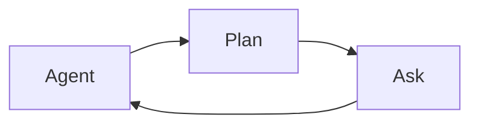

<!-- 5400b761-5d2e-4859-91c7-f2a8df03e2dc -->
---
todos:
  - id: "use-shifttab"
    content: "일상 사용: Plan/Ask에서 Agent로 Shift+Tab 순환"
    status: pending
  - id: "optional-feedback"
    content: "원하면 /feedback용 '/agent 추가 요청' 문구 작성"
    status: pending
  - id: "optional-switch"
    content: "원하면 이 세션에서 SwitchMode로 Agent 전환"
    status: pending
isProject: false
---
# Agent 모드 전환: 이미 있는 방법과 한계

## 결론

**플러그인/커스텀 슬래시 커맨드 개발은 이 목적에 맞지 않습니다.** Cursor의 `.cursor/commands`와 plugin commands는 **프롬프트 템플릿**만 주입하며, Plan/Ask/Agent 같은 **interaction mode를 바꾸는 API가 없습니다**.

이미 쓸 수 있는 전환 수단:

| 방법 | 동작 | 표면 |
|------|------|------|
| **Shift+Tab** | Agent ↔ Plan ↔ Ask (CLI); IDE는 Debug 포함 순환 | CLI + IDE |
| **모드 피커** | 드롭다운에서 Agent 선택 | IDE Agent 패널 |
| **Ctrl+.** (Linux) / Cmd+. | Mode Menu | IDE |
| `/plan`, `/ask`, `/debug` | 해당 모드로 전환/토글 | CLI ([공식 목록](https://cursor.com/docs/cli/reference/slash-commands)) |

**없는 것:** `/agent` — `/plan`·`/ask`·`/debug`와 달리 Agent로 직접 가는 슬래시 커맨드는 [CLI slash commands](https://cursor.com/docs/cli/reference/slash-commands)에 없음. `agent --mode`도 `plan`/`ask`만 받고 Agent가 기본값.

이 세션도 CLI Plan 모드이므로, **지금 Agent로 가려면 입력창에서 Shift+Tab**을 누르면 됩니다 (모드가 Agent로 돌아올 때까지 순환).

## 왜 플러그인으로 못 만드는지

- 커스텀 `/agent.md`는 채팅에 “Agent 모드로 전환해” 같은 **텍스트만** 넣고, UI 모드 플래그를 바꾸지 않음.
- Agent 쪽 `SwitchMode` 툴은 **모델이** Plan↔Agent를 제안할 때 쓰고, 사용자 슬래시 커맨드와 무관하며 승인 UI가 필요함.
- 따라서 “진짜 `/agent`”는 Cursor 제품 기능 추가가 필요하고, vault/로컬 플러그인으로 대체 불가.

## 권장 액션 (구현 대신 사용법 + 피드백)

1. **일상:** Plan/Ask에서 Agent로 복귀 → **Shift+Tab** (CLI·IDE 공통).
2. **IDE에서 고정 단축키가 필요하면:** Command Palette에서 mode 관련 커맨드를 찾아 Keyboard Shortcuts에 바인딩 (제품에 “Switch to Agent” 커맨드가 있으면 그것; 없으면 Mode Menu `Ctrl+.`).
3. **`/agent`를 원하면:** CLI에서 `/feedback`로 비대칭 요청 — 예: “Please add `/agent` slash command symmetric to `/plan` and `/ask`.”
4. **하지 말 것:** mode를 바꾸는 로컬 plugin/`~/.cursor/commands/agent.md` 개발 (효과가 프롬프트 삽입뿐).

## 이 대화에서 다음에 할 일

별도 코드/플러그인 작업은 없음. 확인만 하면 됨:

- Shift+Tab으로 Agent 복귀가 되는지
- `/agent` 공식 추가를 위해 `/feedback` 문구를 대신 작성할지

원하면 플랜 승인 후 **지금 이 세션을 Agent로 전환**(`SwitchMode` → agent)도 가능합니다 (승인 UI가 뜹니다).
