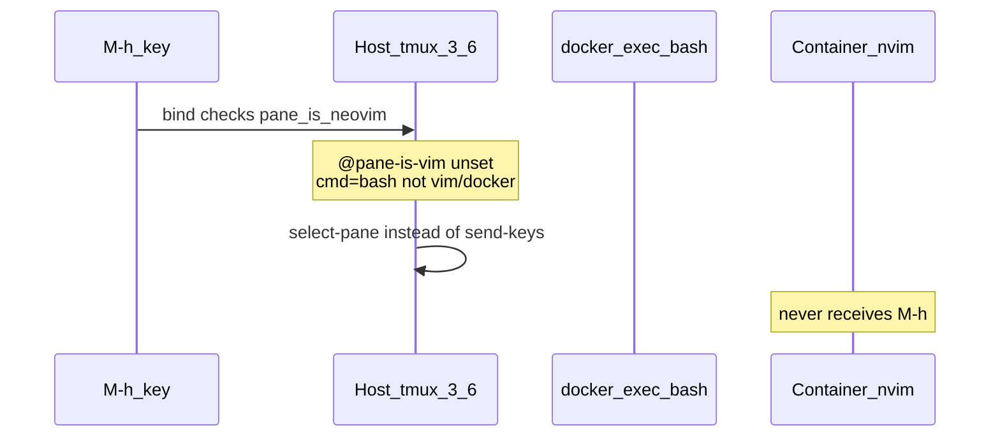

<!-- dfe8de88-4c66-482f-a081-c7ddaaaebd51 -->
---
todos:
  - id: "build-tmux-36a"
    content: "Replace apt tmux with building tmux 3.6a from source in rddev-devenv Dockerfile"
    status: pending
  - id: "trust-pane-is-vim"
    content: "Change pane_is_neovim in tmux.conf to #{@pane-is-vim} only"
    status: pending
  - id: "chezmoi-tmux"
    content: "chezmoi add/commit/push tmux.conf"
    status: pending
  - id: "bootstrap-verify"
    content: "rddev-devenv bootstrap + verify @pane-is-vim from container tmux client"
    status: pending
isProject: false
---
# Fix containerized nvim smart-splits navigation

## Root cause (verified on ree-drive)



Live evidence:

- Pane `%9` runs `rdd` → `docker exec -e TMUX=... -e TMUX_PANE=%9` (shim works).
- Container nvim environ has `TMUX` / `TMUX_PANE=%9`.
- Container `tmux -V` is **3.4**; host is **3.6a**. Client calls return `server exited unexpectedly`.
- Host tmux binary cannot be mounted (needs GLIBC_2.42 + jemalloc; container is Ubuntu 24.04).
- `pane_current_command` is **`bash`**, not `docker`/`nvim`, so the previous `*docker*` guard never matches.

So keys never reach nvim at all — window-to-window moves fail for the same reason as pane edge moves.

## Fix

### 1. Build tmux 3.6a in the overlay image

In [`~/.config/rddev-devenv/Dockerfile`](/home/sungsik/.config/rddev-devenv/Dockerfile):

- Remove apt package `tmux` (pulls 3.4 on Noble).
- Build **tmux 3.6a** from the official tarball into `/usr/local` (matches host `tmux 3.6a`), with build deps cleaned up after install.
- Keep `PATH` so `/usr/local/bin/tmux` is used.

### 2. Trust `@pane-is-vim` alone in tmux bindings

In [`~/.config/tmux/tmux.conf`](/home/sungsik/.config/tmux/tmux.conf), change:

```tmux
pane_is_neovim='#{&&:#{@pane-is-vim},#{||:#{m:*vim*,#{pane_current_command}},#{m:*docker*,#{pane_current_command}}}}'
```

to:

```tmux
pane_is_neovim='#{@pane-is-vim}'
```

Process-name crash-guard cannot work for `rdd`/`docker exec` (command stays `bash` whether nvim is alive or not). Upstream smart-splits already relies on `@pane-is-vim` set/cleared by a working tmux client — which fix (1) restores. Apply to both move (`M-h/j/k/l`) and swap (`C-M-h/j/k/l`) bindings.

### 3. Rebuild and reattach

```bash
cd ~/projects/ree-drive
rddev-devenv bootstrap   # rebuilds overlay (Dockerfile hash stamp) + restarts for mounts
rddev-devenv reattach    # from a tmux pane
```

Then in container nvim, confirm:

- `tmux show-options -pqvt $TMUX_PANE @pane-is-vim` → `1`
- Host: `tmux display-message -p '#{@pane-is-vim} #{pane_current_command}'` on that pane → `1 bash`

### 4. Chezmoi for tmux.conf

Edit live file → `chezmoi add` → commit → push (JmyL account), same as prior dotfiles flow. `rddev-devenv` / Dockerfile stay untracked by chezmoi.

## Out of scope

- No change to nvim `smart-splits.lua` (PATH-based swap script already correct).
- No change to how `rdd` wraps attach (unnecessary once `@pane-is-vim` works).
