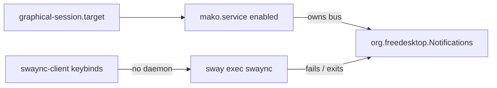

<!-- b494c02c-0496-46d4-9068-fcbfe50b8f13 -->
---
todos:
  - id: "mask-mako"
    content: "Disable/mask user mako.service; add chezmoi symlink_mako.service -> /dev/null"
    status: pending
  - id: "restart-swaync"
    content: "Stop mako, start swaync, verify D-Bus Notifications owner, clear stuck clients"
    status: pending
  - id: "remove-pkg"
    content: "Confirm then apt remove mako-notifier if still installed"
    status: pending
  - id: "chezmoi-commit"
    content: "chezmoi add mask, diff, commit and push personal dotfiles"
    status: pending
isProject: false
---
# swaync 대신 mako가 쓰이는 이유와 복구

## 원인

의도된 설정은 **swaync**입니다.

- Sway가 직접 기동: [`~/.config/sway/config.d/20-swaync.conf`](/home/sungsik/.config/sway/config.d/20-swaync.conf) → `exec ... swaync`
- 키바인딩도 `swaync-client` ([`~/.config/sway/config`](/home/sungsik/.config/sway/config))
- systemd `swaync.service`는 **의도적으로 masked** (chezmoi [`symlink_swaync.service`](/home/sungsik/.local/share/chezmoi/dot_config/systemd/user/symlink_swaync.service) → `/dev/null`) — Jul 19 로그에 sway `exec`와 systemd가 동시에 떠서 `"An instance of SwayNotificationCenter is already running!"` 재시작 루프가 난 뒤의 조치

그런데 현재 런타임은 이렇게 되어 있습니다.

- 패키지 `mako-notifier`가 설치되어 있고, **시스템 전역**으로 enable됨: `/etc/systemd/user/graphical-session.target.wants/mako.service` (Jul 26)
- `mako.service`가 active이며 D-Bus Notifications 소유자(PID의 `/usr/bin/mako`)
- `swaync` 데몬 프로세스는 없고, `swaync-client`만 대기 중 (키바인딩이 죽은 데몬을 호출)
- chezmoi는 이미 mako 설정/스크립트를 [`.chezmoiremove`](/home/sungsik/.local/share/chezmoi/.chezmoiremove)로 제거 대상으로 둠 — mako는 “남겨둔 선택”이 아니라 **패키지 부작용**

## 복구 계획

dotfiles 설계(sway `exec`만으로 swaync 기동, systemd swaync는 mask 유지)를 그대로 살립니다.

1. **사용자 단위로 mako 차단**  
   `systemctl --user disable --now mako.service`  
   `systemctl --user mask mako.service`  
   chezmoi에도 swaync와 같은 패턴으로 [`~/.config/systemd/user/mako.service` → `/dev/null`](file:///dev/null) 심볼릭을 추가해 재적용·다른 머신에서도 mako가 안 뜨게 함.

2. **swaync 다시 기동**  
   `swaync`를 한 번 실행하거나 sway reload/`exec` 경로로 기동.  
   `busctl --user status org.freedesktop.Notifications`로 소유자가 `swaync`인지 확인.  
   멈춰 있는 `swaync-client` 프로세스는 정리.

3. **패키지**  
   `mako-notifier`는 전역 wants 심볼릭을 다시 만들 수 있으므로, 확인 후 `sudo apt remove mako-notifier` 제안. (시스템 패키지 변경이라 실행 전 한 번 확인.)

4. **dotfiles 반영**  
   live mask 추가 후 `chezmoi add ~/.config/systemd/user/mako.service`, diff 검토, 커밋·푸시 (개인 chezmoi `JmyL`).

변경하지 않을 것: `swaync.service` mask 유지, sway `20-swaync.conf`의 `exec swaync` 유지.
