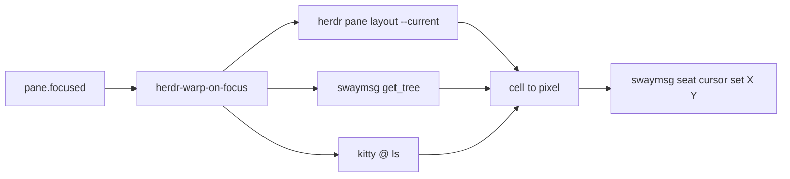

<!-- 9b8d7510-bb4f-4243-a9b4-c83bae58191c -->
---
todos:
  - id: "script"
    content: "Add ~/.local/bin/herdr-warp-on-focus (layout+kitty+sway → seat cursor set; host spawn; disable env)"
    status: completed
  - id: "plugin"
    content: "Add local herdr-plugin.toml on pane.focused; link via herdr-install-plugins"
    status: completed
  - id: "chezmoi"
    content: "chezmoi add, reload/link plugin, commit+push personal dotfiles"
    status: completed
isProject: false
---
# Herdr pane mouse warp-on-focus

## Why

Herdr wheel scroll targets the pane **under the pointer** (and focuses it), not the keyboard-focused pane. Keyboard pane moves leave the pointer behind, so wheel keeps scrolling the old pane.

## Prior art search (2026-08-06)

No existing Herdr plugin does pane-focus → host pointer warp.

Checked:

- Installed plugins under `~/.config/herdr/plugins/github` (focus-notify, splits, navigator, pluck, plus, …) — no warp/`seat cursor`/`mousemove`
- GitHub `topic:herdr-plugin` (~100 repos) and name/desc search for mouse/warp/cursor/pointer/scroll — closest hits are unrelated (`herdr-focus-notify` = toast→focus, `herdr-scrollback-capture` = save scrollback, mouse-friendly file viewers)
- [awesome-herdr](https://github.com/yigitkonur/awesome-herdr) Terminal UX list — no warp-on-focus entry
- Code search for `pane.focused` + `swaymsg` / `cursor set` in herdr plugins — no match

Sway’s own `mouse_warping container` only moves the pointer between **windows**, not Herdr panes inside one kitty window.

Conclusion: custom small plugin/script is still the path; nothing to reuse.

## Approach

Small Linux/Sway Herdr plugin on `pane.focused` that warps the seat cursor into the newly focused pane.

- **Placement:** pane rect의 **오른쪽 끝 · 세로 중앙** (scrollbar 근처). 본문 중앙보다 덜 가림.
- **Warp:** `swaymsg 'seat seat0 cursor set <x> <y>'` (이미 이 머신에서 동작 확인). ydotool 불필요.
- **Hide:** 기존 Sway [`seat * hide_cursor 3000`](file:///home/sungsik/.config/sway/config) 그대로 — warp 직후 잠깐 보이다가 숨김. hide timeout은 변경하지 않음.
- **Cell size:** focused kitty window의 `columns`/`lines` (`kitty @ ls`) + Sway `rect` → `cell_w/h`. Outer terminal이 kitty가 아니거나 metrics를 못 얻으면 no-op.
- **Host/toolbox:** `swaymsg` / 필요 시 `kitty @`는 focus-notify와 같이 host에서 실행 (`flatpak-spawn --host` when `/run/.containerenv` 존재).

## Files

- Script: [`~/.local/bin/herdr-warp-on-focus`](file:///home/sungsik/.local/bin/herdr-warp-on-focus) (bash, `shfmt -i 2`)
  - Read `HERDR_PLUGIN_EVENT` / event JSON pane id (or just use current focused from layout)
  - Compute target; warp; quiet success; stderr only on real failures
  - Disable: `HERDR_WARP_ON_FOCUS=0`
- Plugin manifest: [`~/.config/herdr/plugins/local/herdr-pane-mouse-warp/herdr-plugin.toml`](file:///home/sungsik/.config/herdr/plugins/local/herdr-pane-mouse-warp/herdr-plugin.toml)
  - `[[events]] on = "pane.focused"` → run the script
- Wire install: extend [`~/.local/bin/herdr-install-plugins`](file:///home/sungsik/.local/bin/herdr-install-plugins) to `herdr plugin link` the local path after github installs (or a one-line link now + document). Prefer local+chezmoi over a new GitHub repo for this small script.
- Chezmoi: `chezmoi add` the script, plugin dir, and installer change; commit/push personal (`JmyL`).

## Out of scope

- Wheel-follows-focus upstream change
- macOS / non-Sway
- Changing Sway `hide_cursor` timeout
- Mouse-using workflows beyond warp target choice
