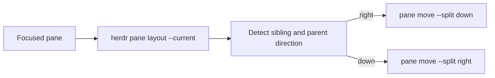

<!-- cb1eae12-890b-48b8-937f-77a0d0c37091 -->
---
todos:
  - id: "script"
    content: "~/.local/bin/herdr-rotate-split: layout에서 sibling/direction 감지 후 pane move로 토글"
    status: pending
  - id: "bind"
    content: "config.toml에 prefix+space shell 키바인딩 추가"
    status: pending
  - id: "chezmoi"
    content: "chezmoi add + diff 후 commit/push"
    status: pending
isProject: false
---
# Herdr split 방향 토글 단축키

## 결론

전용 rotate API/키는 없음. **작은 스크립트 + shell 키바인딩**이 기존 설정 스타일과 가장 잘 맞음.

## 추천 동작

포커스된 pane의 **직접 형제 split만** 상하(`down`) ↔ 좌우(`right`) 토글.



구현 스케치:

1. `herdr pane current` / `herdr pane layout --current`로 focused pane, tab, splits 읽기
2. focused를 포함한 가장 안쪽 split의 `direction`과 sibling 찾기
3. opposite로 `herdr pane move <focused> --tab <tab> --split <right|down> --target-pane <sibling> --ratio <same>`
4. pane이 1개거나 sibling을 못 찾으면 no-op (toast 없이도 quiet exit 0 또는 1)

근거: live API에서 2-pane 좌우 레이아웃은 `splits[].direction == "right"`이고, neighbor는 `left`/`right`로 sibling을 줌. `pane move --split`이 프로세스 유지한 채 방향을 바꿀 수 있는 공식 CLI.

복잡한 3+ pane 트리(예: 좌우 안에 또 좌우)는 **직접 부모 split만** 뒤집는 쪽으로 제한. 전체 레이아웃 cycle(tmux `next-layout`)은 하지 않음.

## 키 후보

기존 맵과 겹치지 않는 추천:

| 후보 | 이유 |
|------|------|
| `prefix+space` | tmux `next-layout` 감각, 현재 미사용 |
| `alt+shift+x` | `alt+x`(좌우 split) 옆, 방향 전환 연상 |
| `prefix+r` | resize_mode가 주석 처리되어 비어 있음. rotate 연상 |

**기본값: `prefix+space`** (`prefix`는 이미 `alt+a`).

## 배선

1. 스크립트: [`~/.local/bin/herdr-rotate-split`](~/.local/bin/herdr-rotate-split) (bash, `shfmt -i 2` 스타일)
2. 키바인딩: [`~/.config/herdr/config.toml`](~/.config/herdr/config.toml)

```toml
[[keys.command]]
key = "prefix+space"
type = "shell"
command = "herdr-rotate-split"
description = "toggle split orientation"
```

`type = "shell"`은 default config상 detached background 실행이라 UI를 가리지 않음. `popup`/`pane`은 불필요.

3. chezmoi: live 편집 후 `chezmoi add` → diff → commit/push (dotfiles 워크플로).

## 하지 않을 것

- Herdr 플러그인으로 키우기: 토글 한 기능엔 과함
- 소켓 `layout.apply` 직접 호출: 가능하지만 CLI/`pane move`보다 깨지기 쉽고 유지보수 비용 큼
- 강제 방향 2키(`to-right` / `to-down`): 토글 하나로 충분하면 생략

## 검증

- 2-pane 좌우 → 단축키 → 상하, 다시 → 좌우
- 단독 pane → 변화 없음
- agent 세션/스크롤백이 move 후에도 유지되는지 확인
