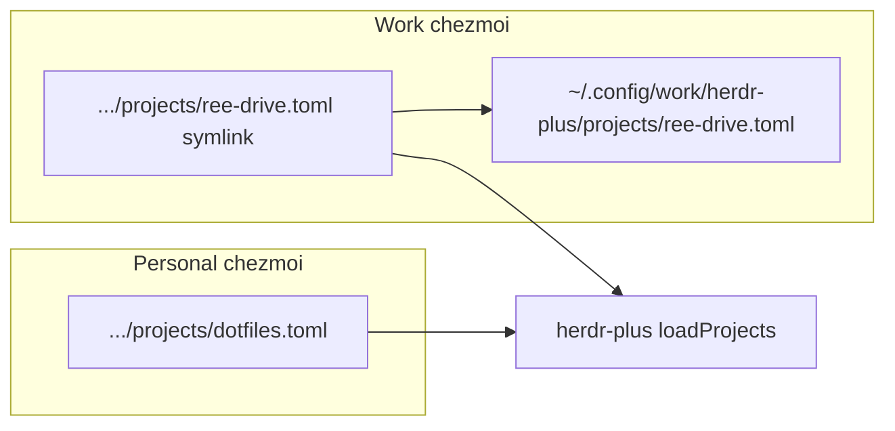

<!-- 228c85d0-d539-4a78-9477-7f2cd43f08ce -->
---
todos:
  - id: "helper"
    content: "Add ~/.local/bin/herdr-plus-chezmoi; route work vs personal by working_dir under ~/projects"
    status: completed
  - id: "docs"
    content: "Update AGENTS.md/CLAUDE.md and chezmoi-work README (no name-prefix rule)"
    status: completed
  - id: "track-personal"
    content: "chezmoi add unmanaged personal projects/dotfiles.toml; manage helper via chezmoi"
    status: completed
  - id: "verify"
    content: "Dry-run working_dir routing + symlink path; confirm herdr-plus would see symlink .toml"
    status: completed
isProject: false
---
# Herdr-plus projects: work chezmoi 분리

## 왜 이 방식인가

herdr-plus는 **한 디렉터리만** 읽는다 (`herdr plugin config-dir cloudmanic.herdr-plus` → `projects/*.toml`). 외부 경로/다중 디렉터리는 지원하지 않고, `toml.DecodeFile`은 symlink를 따라가므로 tmuxinator와 같은 **canonical + symlink** 패턴이 맞다.

라우팅은 tmuxinator의 `ree-*`/`vay-*` **이름 규칙이 아니라**, project TOML의 `working_dir`가 **`$HOME/projects` 아래**(또는 그 자체)이면 work로 본다. 실제 머신/기존 tmuxinator root도 `~/projects/...`를 쓴다.



| | personal | work |
|---|---|---|
| 판별 | `working_dir`가 `$HOME/projects` 밖 (또는 비어 home 기본) | `working_dir`가 `$HOME/projects` 또는 그 하위 |
| live 파일 | discovery dir 실파일 | `~/.config/work/herdr-plus/projects/<file>.toml` |
| discovery | 그대로 | 같은 이름 symlink → work canonical |
| chezmoi | personal | work (`chezmoi-work.toml`) |

상대 symlink는 discovery dir이 깊어서 `../../../../../work/herdr-plus/projects/<name>.toml` 형태. home 경로(`/home` vs `/var/home`)에 안전.

## 라우팅 규칙 (헬퍼)

`working_dir`를 `~` / `$HOME` 펼친 뒤 realpath(가능하면)하고:

- prefix가 `$HOME/projects`이면 → **work**
- 그 외(미설정·`~`·`~/.config` 등) → **personal**

절대경로(`/home/.../projects/...`, `/var/home/.../projects/...`)도 `$HOME/projects` prefix로 동일 판별. 파일 **이름**은 보지 않음.

`track-add`가 discovery dir에 있는 실파일을 읽었는데 work로 판정되면: canonical로 옮기고 discovery는 symlink로 바꾼 뒤 work chezmoi에 add. 반대로 work symlink인데 personal로 바뀌면(working_dir 수정) 역이동 후 personal add.

## 구현

### 1. 헬퍼 [`~/.local/bin/herdr-plus-chezmoi`](~/.local/bin/herdr-plus-chezmoi)
[`tmuxinator-chezmoi`](~/.local/bin/tmuxinator-chezmoi) 구조를 따르되 `is-work`는 이름 대신 TOML `working_dir` 파싱:

- `kind <name-or-path>` — 파일 읽어 work/personal 출력
- `toml-path` / `link-path` / `resolve`
- `prepare-new <name> <working_dir>` — working_dir로 kind 결정 후 stub 생성(+ work면 symlink)
- `ensure-link` / `track-add` / `track-delete`
- stub: `name`, `working_dir`, `[[tabs]]` 최소 스키마
- delete 시 work면 `.chezmoiremove`에 canonical + discovery link 경로 append
- personal bin으로 chezmoi 관리

### 2. 문서
- [`AGENTS.md`](~/.config/AGENTS.md) / [`CLAUDE.md`](~/.config/CLAUDE.md): herdr-plus projects는 `working_dir` ∈ `$HOME/projects` → work chezmoi + symlink; 이름 prefix 규칙 없음 (tmuxinator의 ree-/vay-와 **다름**을 명시)
- [`chezmoi-work/README.md`](~/.local/share/chezmoi-work/README.md): `~/.config/work/herdr-plus/` + discovery symlink

### 3. 안전장치
- personal [`.chezmoiignore`](~/.local/share/chezmoi/.chezmoiignore)의 `.config/work/` 유지 (canonical 보호)
- **이름 glob ignore는 넣지 않음** (라우팅이 이름 무관). work 링크는 헬퍼/`track-add`로만 work chezmoi에 넣도록 문서화. discovery dir 통째 `chezmoi add`는 금지.

### 4. 기존 파일
- `herdr-plus-projects.toml` — personal (working_dir이 herdr config)
- live [`dotfiles.toml`](~/.config/herdr/plugins/config/cloudmanic.herdr-plus/projects/dotfiles.toml) — personal로 `chezmoi add`
- work herdr-plus 프로젝트는 아직 없음 → 레이아웃만 준비

## agent 워크플로 (적용 후)

```bash
# personal (working_dir not under ~/projects)
$EDITOR ~/.config/herdr/plugins/config/cloudmanic.herdr-plus/projects/dotfiles.toml
herdr-plus-chezmoi track-add dotfiles

# work (working_dir under ~/projects)
herdr-plus-chezmoi prepare-new ree-drive ~/projects/ree-drive
$EDITOR "$(herdr-plus-chezmoi resolve ree-drive)"
herdr-plus-chezmoi track-add ree-drive
```

quick-actions / worktrees는 이번 범위 밖.
