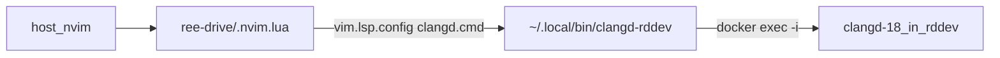

<!-- 2f381f0c-efb8-49b9-b1c1-6e41052600e4 -->
---
todos:
  - id: "overlay-clangd"
    content: "Add clangd-18 to ~/.config/rddev-devenv/Dockerfile and rebuild overlay via bootstrap"
    status: pending
  - id: "shim"
    content: "Create ~/.local/bin/clangd-rddev (docker exec -i wrapper)"
    status: pending
  - id: "nvim-lua"
    content: "Add ree-drive/.nvim.lua to override clangd cmd; exclude via .git/info/exclude"
    status: pending
  - id: "verify"
    content: "Trust config-local, confirm :LspInfo and header go-to-def via container clangd"
    status: pending
isProject: false
---
# Host Neovim + in-container clangd via `.nvim.lua`

You already have this path: [`~/.config/nvim/lua/custom/plugins/local.lua`](/home/sungsik/.config/nvim/lua/custom/plugins/local.lua) loads trusted project files named `.nvim.lua` (parent lookup on). No global nvim change is required.



## Defaults chosen

- **Personal only** (matches `rddev-devenv`): wrapper + `.nvim.lua` + overlay Dockerfile change; do not commit into ree-drive.
- Override LSP **only** from project `.nvim.lua`, not from kickstart `lspconfig.lua`.
- Install **`clangd-18`** in the personal overlay image (base `telestation:dev-marmot` has `clang++-18` / `clang-tools-18` but **no** `clangd` binary today).

## 1. Install clangd in the devenv overlay

Edit [`~/.config/rddev-devenv/Dockerfile`](/home/sungsik/.config/rddev-devenv/Dockerfile): add `clangd-18` to the existing `apt-get install` list (same `RUN` as luarocks/ripgrep), and ensure `/usr/bin/clangd` exists (symlink to `clangd-18` if the package only ships the versioned binary).

Then rebuild via `rddev-devenv bootstrap` so the overlay stamp picks up the Dockerfile hash.

## 2. Host shim `~/.local/bin/clangd-rddev`

Create an executable that:

1. Resolves git toplevel.
2. Parses container name from `"$root/misc/rddev" status` (`Container name: …`), same as your existing devenv helper.
3. Verifies the container is running.
4. `exec docker exec -i -w "$root" "$name" clangd "$@"` — **`-i` only, never `-t`**.

## 3. Project local config [`ree-drive/.nvim.lua`](/home/sungsik/projects/ree-drive/.nvim.lua)

```lua
local shim = vim.fn.expand('~/.local/bin/clangd-rddev')
if vim.fn.executable(shim) == 0 then
  vim.notify('clangd-rddev not found/executable', vim.log.levels.WARN)
  return
end

vim.lsp.config('clangd', {
  cmd = {
    shim,
    '--background-index',
    '--header-insertion=never',
  },
})

-- If clangd already attached (nvim opened with a .cpp), restart it.
for _, client in ipairs(vim.lsp.get_clients { name = 'clangd' }) do
  client:stop(true)
end
```

Also append `.nvim.lua` to [`.git/info/exclude`](/home/sungsik/projects/ree-drive/.git/info/exclude) so it stays local.

On first open: trust with `:ConfigLocalTrust` (nvim-config-local hash gate). After edits to `.nvim.lua`, trust again if prompted.

## 4. Verify

1. Container running (`rddev-devenv start` / `reattach` as you prefer).
2. `clangd-rddev --version` prints container `clangd` 18.x.
3. Host `nvim` on a C++ file under ree-drive → `:LspInfo` shows cmd starting with `clangd-rddev`.
4. Go-to-definition into a system/third-party header under `/usr` or `/opt` succeeds.

## Out of scope

- No changes to [`misc/rddev`](/home/sungsik/projects/ree-drive/misc/rddev) or shared repo docs.
- No host sysroot export.
- No change to global [`lspconfig.lua`](/home/sungsik/.config/nvim/lua/kickstart/plugins/lspconfig.lua) `clangd = {}` (project file overrides `cmd`).
