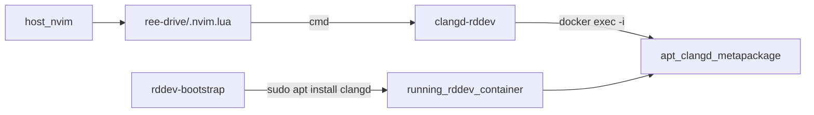

<!-- 2f381f0c-efb8-49b9-b1c1-6e41052600e4 -->
---
todos:
  - id: "step1-shim"
    content: "Create ~/.local/bin/clangd-rddev; test that it errors clearly when container is down"
    status: completed
  - id: "step2-bootstrap-install"
    content: "Create ~/.local/bin/rddev-bootstrap that apt-installs clangd into the running rddev container; verify clangd --version is 18.x"
    status: completed
  - id: "step3-shim-e2e"
    content: "Re-test clangd-rddev --version against live container (must match in-container clangd)"
    status: completed
  - id: "step4-nvim-lua"
    content: "Add ree-drive/.nvim.lua + .git/info/exclude; document :ConfigLocalTrust"
    status: completed
  - id: "step5-lsp-check"
    content: "Host nvim :LspInfo shows clangd-rddev; go-to-def into a /usr header works"
    status: completed
isProject: false
---
# Host Neovim + container clangd (`rddev-bootstrap`)



## Defaults

- **Do not modify** [`~/.local/bin/rddev-devenv`](/home/sungsik/.local/bin/rddev-devenv) or its Dockerfile/overlay.
- New personal scripts only:
  - [`~/.local/bin/rddev-bootstrap`](/home/sungsik/.local/bin/rddev-bootstrap)
  - [`~/.local/bin/clangd-rddev`](/home/sungsik/.local/bin/clangd-rddev)
- Install the **`clangd` metapackage** inside the **running** container (`Depends: clangd-18`). No custom overlay image.
- Project-local [`.nvim.lua`](/home/sungsik/projects/ree-drive/.nvim.lua) (gitignored via `.git/info/exclude`); no global lspconfig change.
- Proceed **step-by-step with a verify gate after each step** before moving on.

## Why runtime apt (not overlay)

Leaving `rddev-devenv` alone means we must not fight its image rewrite. Installing into the live container works whether the user started via plain `rddev` or `rddev-devenv`. Trade-off: after a full container recreate from a fresh image, re-run `rddev-bootstrap`.

## Step 1 — `clangd-rddev` shim (test before install)

Create [`~/.local/bin/clangd-rddev`](/home/sungsik/.local/bin/clangd-rddev):

- Resolve git root → `"$root/misc/rddev" status` → `Container name:`
- Require container running
- `exec docker exec -i -w "$root" "$name" clangd "$@"` (no `-t`)

**Gate:** With container stopped (or missing clangd), `clangd-rddev --version` fails with a clear message. With container up but no clangd yet, failure should mention clangd missing / non-zero from docker exec — proves wiring before we install.

## Step 2 — `rddev-bootstrap`

Create [`~/.local/bin/rddev-bootstrap`](/home/sungsik/.local/bin/rddev-bootstrap):

1. Find repo root + `misc/rddev`.
2. If container not running: `./misc/rddev start` (plain rddev; not devenv).
3. Idempotent install:

```bash
docker exec "$name" bash -lc \
  'command -v clangd >/dev/null || sudo DEBIAN_FRONTEND=noninteractive apt-get update -qq && sudo DEBIAN_FRONTEND=noninteractive apt-get install -y --no-install-recommends clangd'
```

(Exact idempotent shell will short-circuit when `clangd` already exists.)

4. Print `clangd --version` from inside the container.
5. Ensure `clangd-rddev` is on PATH / executable (install or refresh the shim if kept next to bootstrap).

**Gate:** `docker exec … clangd --version` shows **18.x**. `apt-cache policy clangd` shows installed.

## Step 3 — shim end-to-end

**Gate:** Host `clangd-rddev --version` matches in-container version.

## Step 4 — project `.nvim.lua`

```lua
local shim = vim.fn.expand('~/.local/bin/clangd-rddev')
assert(vim.fn.executable(shim) == 1)
vim.lsp.config('clangd', {
  cmd = { shim, '--background-index', '--header-insertion=never' },
})
for _, c in ipairs(vim.lsp.get_clients { name = 'clangd' }) do
  c:stop(true)
end
```

Append `.nvim.lua` to [`.git/info/exclude`](/home/sungsik/projects/ree-drive/.git/info/exclude).

**Gate:** File exists, excluded from `git status`, user runs `:ConfigLocalTrust` once.

## Step 5 — LSP check

**Gate:** Host `nvim` on a C++ file under ree-drive → `:LspInfo` cmd starts with `clangd-rddev`; go-to-definition into a `/usr` (or `/opt`) header succeeds while the container is up.

## Out of scope

- No changes to `rddev-devenv`, its overlay, or shared ree-drive packages.
- No sysroot export, no `--remote-ui`.
