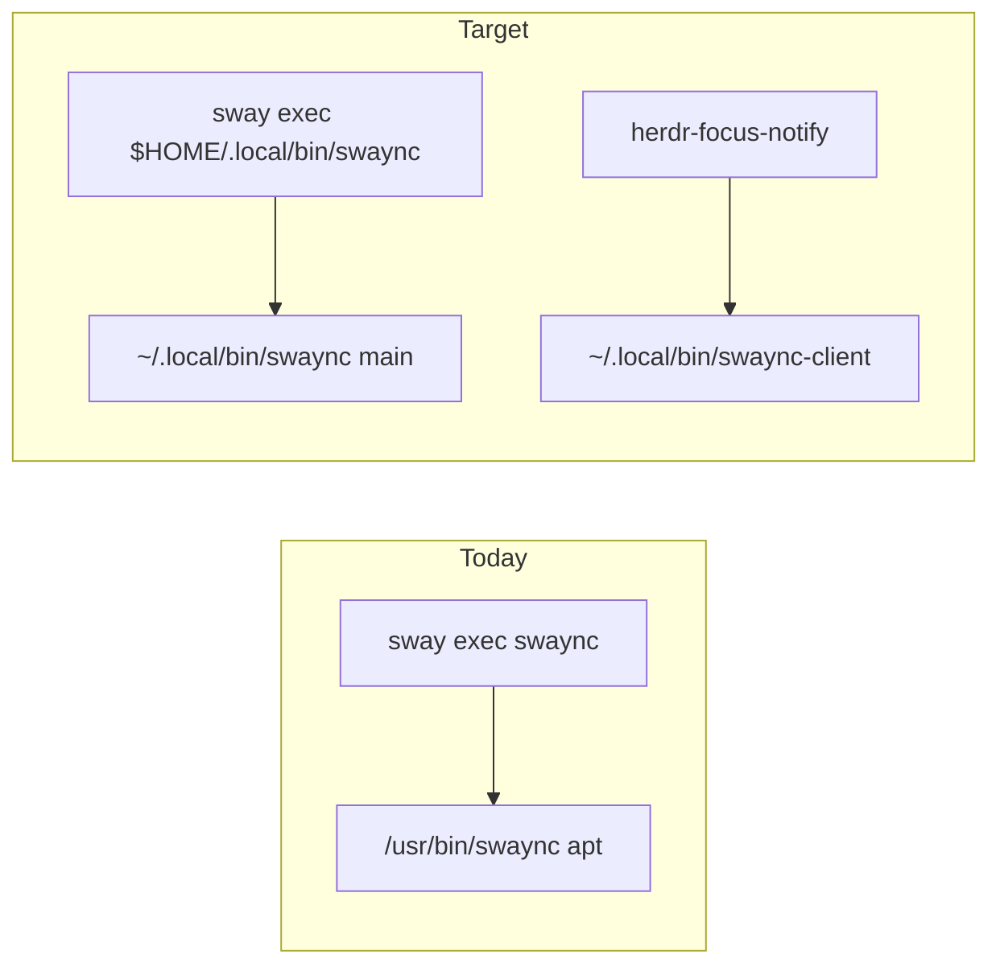

<!-- 5aed39ae-0506-45e1-8d19-442f902d7c26 -->
# ~/.local swaync 빌드와 sway/herdr 연결

## 결론부터

`dev-launcher`만으로 되지는 **않는다**. 다만 그 안의 “`~/.local/bin`을 PATH 앞에 둔다”는 문제는 맞고, swaync에는 **toolbox 우회 없이** 그 경로를 **직접** 가리키는 쪽이 맞다.

근거:

- sway 세션 user 환경 PATH는 `/usr/local/bin:/usr/bin:...`뿐이고 **`~/.local/bin`이 없음** (`systemctl --user show-environment`).
- 그래서 [`sway/config.d/20-swaync.conf`](/home/sungsik/.config/sway/config.d/20-swaync.conf)의 `command -v swaync` / bare `swaync-client`는 지금·앞으로도 **apt `/usr/bin`** 만 고른다.
- [`dev-launcher`](/home/sungsik/.local/bin/dev-launcher)는 PATH 앞에 `~/.local/bin`을 붙이지만, Silverblue에서는 `toolbox run`으로 넘긴다. swaync는 호스트 Wayland/D-Bus 데몬이라 toolbox 안 실행은 위험하다.
- sway는 이미 대부분 `~/.local/bin/...` **절대 경로**를 쓴다. swaync만 bare name인 상태다.



## 선택한 방식

1. `meson setup --prefix="$HOME/.local"` 로 설치 (apt 패키지는 **유지**, 폴백용).
2. sway는 `dev-launcher` 대신 **`$HOME/.local/bin/swaync{,-client}` 우선 + 없으면 시스템** 패턴.
3. herdr-focus-notify의 `swaync_candidate_paths()`에 `~/.local/bin`을 **맨 앞**에 추가 (alerter/herdr와 동일). home은 toolbox와 공유되므로 Silverblue에서도 파일 존재 검사로 호스트 바이너리를 찾을 수 있다.

## 1. Ubuntu에서 `~/.local` 빌드

빌드 의존성(대략): `meson`, `vala`, `scssc`/`sassc`, `scdoc`, `blueprint-compiler`, `libgtk-4-dev`, `libgtk4-layer-shell-dev`, `libadwaita-1-dev`, `libgee-0.8-dev`, `libjson-glib-dev`, `libpulse-dev`, `libgranite-7-dev` 등 (README Other 섹션 기준).

```bash
git clone https://github.com/ErikReider/SwayNotificationCenter.git
cd SwayNotificationCenter
meson setup build --prefix="$HOME/.local" --buildtype=release
meson compile -C build
meson install -C build
```

검증: `~/.local/bin/swaync-client --help`에 `--action` 기본 동작/`--close [ID]` 등 main 쪽 문구가 보이는지, `swaync-client -v`가 apt(0.12.4)와 다른지.

설정/CSS는 기존처럼 `~/.config/swaync/` (또는 `/etc/xdg` 폴백)를 쓰므로 prefix와 충돌하지 않는다. D-Bus activation 파일은 `~/.local/share/dbus-1/services/`에 생길 수 있으나, 지금은 systemd user unit이 masked이고 sway `exec_always`로 띄우므로 **데몬은 sway 경로만 맞으면 충분**하다.

## 2. Sway 연결 (필수)

[`~/.config/sway/config.d/20-swaync.conf`](/home/sungsik/.config/sway/config.d/20-swaync.conf)를 local 우선으로 바꾼다:

```sh
exec_always sh -c 'bin="$HOME/.local/bin/swaync"; [ -x "$bin" ] || bin=$(command -v swaync) || exit 0; pkill -x swaync 2>/dev/null || true; exec "$bin"'
```

[`~/.config/sway/config`](/home/sungsik/.config/sway/config) 키바인딩(약 306–310행)도 동일하게 local client 우선:

- `$mod+n` / `$mod+Shift+n`: 기존 플래그 유지
- `$mod+Return`: 주석이 “default action”이므로 새 바이너리 기준으로 **`swaync-client -a -sw`** (인자 없음 = PR #712 default). 현재 `-a 0`은 alt[0]이라 herdr/claude의 labeled `focus`/`goto`와는 우연히 맞지만, 의도와 새 CLI에 맞춘다.

패턴 예:

```sh
exec sh -c 'c="$HOME/.local/bin/swaync-client"; [ -x "$c" ] || c=swaync-client; exec "$c" -a -sw'
```

`sway reload` 후 `pgrep -a swaync`가 `.../.local/bin/swaync`인지 확인.

chezmoi: live 편집 후 `chezmoi add` → diff → commit/push (personal).

## 3. herdr-focus-notify 연결

소스: [`~/projects/herdr-focus-notify`](/home/sungsik/projects/herdr-focus-notify) (`JmyL/herdr-focus-notify`).  
설치본 [`notifier.rs`](/home/sungsik/.config/herdr/plugins/github/herdr-focus-notify-ccefc5102048/src/notifier.rs)의 `swaync_candidate_paths()`는 지금 `/usr/bin`, `/usr/local/bin`만 있다. `find_executable`은 PATH 다음 후보를 보는데, herdr/플러그인 PATH에 `~/.local/bin`이 없거나 호스트-only 바이너리면 apt로 떨어진다. `--close [ID]`는 main(PR #713)에만 있어 **local client가 필수**에 가깝다.

변경:

```rust
fn swaync_candidate_paths() -> Vec<PathBuf> {
    let mut paths = Vec::new();
    if let Some(home) = home_dir() {
        paths.push(home.join(".local/bin/swaync-client"));
    }
    paths.push(PathBuf::from("/usr/bin/swaync-client"));
    paths.push(PathBuf::from("/usr/local/bin/swaync-client"));
    paths
}
```

이후 플러그인 레포 push → [`~/.config/herdr/plugins.list`](/home/sungsik/.config/herdr/plugins.list) ref 갱신 → `herdr-install-plugins` → chezmoi add/commit/push.

알림 클릭/액션 자체는 D-Bus로 데몬에 가므로, **떠 있는 swaync가 local 빌드**인 것이 핵심이고, client 후보는 dismiss(`--close`) 경로용이다.

## 4. `dev-launcher` / Silverblue와의 관계

| 용도 | 권장 |
|------|------|
| swaync 데몬·client (sway bind) | `$HOME/.local/bin/...` 직접 (이번 계획) |
| uv/dictate 등 toolbox 도구 | 기존 `dev-launcher` 유지 |
| Silverblue 나중에 | 호스트 home에 같은 `~/.local` 설치 + 동일 sway/herdr 설정으로 공유. COPR 패키지가 따라잡으면 local prefix만 지우면 apt/COPR로 폴백 |

## 5. 롤백

- `rm -f ~/.local/bin/swaync ~/.local/bin/swaync-client` (및 meson install로 깔린 share 잔여물) 후 `sway reload` → apt 경로로 복귀.
- 키바인딩/herdr 후보는 local이 없으면 시스템으로 떨어지게 작성한다.

## 범위 밖

- apt 제거, PPA, Silverblue 호스트 빌드 자동화, `dev-launcher` 개조(swaync 예외 분기)는 하지 않는다.
- [`claude-notify-and-goto`](/home/sungsik/.local/bin/claude-notify-and-goto) 주석의 “`-a`는 labeled만”은 **옛 동작** 설명이다. 키바인드만 새 CLI에 맞추면 스크립트 자체는 `default`/`goto` 둘 다 처리하므로 필수는 아니다.
