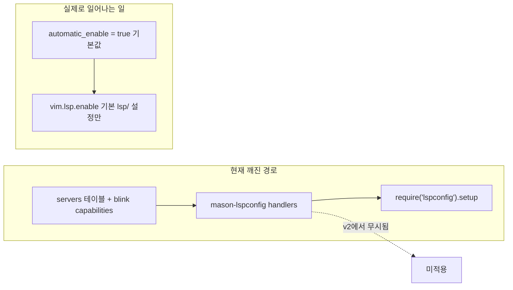

<!-- d478e19e-e9aa-48a6-a51e-d67c2b1d50aa -->
# Neovim 0.12 설정 감사 (treesitter 제외)

현재 호스트는 **NVIM v0.12.4** (Ubuntu). 공식 [news-0.12](https://neovim.io/doc/user/news-0.12/) breaking change와 대조했습니다.

## 결론

**당장 손봐야 할 곳은 LSP enable 경로 한 곳**입니다. diagnostic/`vim.loop`/keymap 쪽은 치명적 깨짐이 없고, blink·telescope·conform·gitsigns 등은 0.12와 충돌하는 패턴이 없습니다. `vim.pack`/네이티브 completion으로 갈아타는 것은 “필요”가 아니라 선택 사항이라 이번 범위에서 제외합니다.



## 1. 필수: LSP / mason-lspconfig v2 마이그레이션

파일: [`lua/kickstart/plugins/lspconfig.lua`](lua/kickstart/plugins/lspconfig.lua)

설치된 `mason-lspconfig` v2는 다음을 **제거**했습니다.

- `handlers` / `.setup_handlers()`
- `automatic_installation`

대신 `automatic_enable = true`(기본)로 설치된 서버에 `vim.lsp.enable()`만 호출합니다. `settings.set()`이 unknown key를 그냥 merge하므로, 지금 `handlers` 블록은 **에러 없이 무시**됩니다.

그 결과:

- `lua_ls` / `bashls` / `yamlls` schemas / `texlab` 등 `servers` 커스텀 설정이 **적용되지 않음**
- `blink.cmp` capabilities merge도 **적용되지 않음**
- `require('lspconfig')[name].setup(...)`는 nvim-lspconfig에서 deprecated (v3에서 제거 예정)

**수정 방향** (upstream kickstart / nvim-lspconfig README와 동일):

```lua
local capabilities = require('blink.cmp').get_lsp_capabilities()

for name, server in pairs(servers) do
  server.capabilities = vim.tbl_deep_extend('force', {}, capabilities, server.capabilities or {})
  vim.lsp.config(name, server)
end

require('mason-lspconfig').setup {
  ensure_installed = {},
  -- servers 테이블에 없는 자동 enable을 막으려면:
  -- automatic_enable = { exclude = { ... } } 또는 false 후 수동 vim.lsp.enable
}
-- 원하는 서버만 켜려면:
vim.lsp.enable(vim.tbl_keys(servers))
```

`LspAttach` 키맵·`vim.diagnostic.config` 블록은 이미 현대식이라 유지합니다. `client_supports_method` 0.10/0.11 shim(112–123행)은 `client:supports_method(...)`만 남기면 됩니다.

참고: `ensure_installed`에만 있고 `servers`에 없는 `gh-actions-language-server`는, mason auto-enable 정책에 따라 의도치 않게 enable될 수 있으니 마이그레이션 때 명시적으로 포함/제외를 정합니다.

## 0.12 breaking change 대조 (treesitter 제외)

| Breaking change | 이 설정 | 조치 |
|---|---|---|
| diagnostic signs는 `vim.diagnostic.config`만 | 이미 사용 중 (168–194행) | 없음 |
| `vim.diagnostic.disable` / legacy `enable` 제거 | 미사용 | 없음 |
| `vim.diff` → `vim.text.diff` | 미사용 | 없음 |
| semantic_tokens `start/stop` → `enable` | 미사용 | 없음 |
| `vim.loop` 제거 방향 | [`lazy-bootstrap.lua`](lua/lazy-bootstrap.lua), [`health.lua`](lua/kickstart/health.lua)에 `vim.uv or vim.loop` | `vim.uv`로 단순화 (예방) |
| DAP `sign_define` | [`debug.lua`](lua/kickstart/plugins/debug.lua) | diagnostic API가 아니라서 유지 OK |
| `'shelltemp'` 기본 false / Insert `Ctrl-R` literal | 설정 코드 없음 | 인지용 |

## 2. 권장 정리 (동작에는 거의 영향 없음)

- [`lua/kickstart/health.lua`](lua/kickstart/health.lua): 버전 체크 `0.10-dev` → `0.12`
- keymap/autocmd `buffer` → `buf` (0.12 deprecated, 아직 동작): lspconfig, gitsigns, aerial, init 등
- [`lua/custom/plugins/copilot.lua`](lua/custom/plugins/copilot.lua): lazy 키 `enable` → `enabled` (오타로 플러그인이 의도대로 꺼지지 않을 수 있음)

## 3. 0.12와 무관한 기존 버그 (원하면 같이)

- [`oil.lua`](lua/custom/plugins/oil.lua): `vim.keymap.set(...)`가 `opts` 테이블 안에 있어 opts를 오염시킴 — 키맵은 `config`/`keys`로 분리
- [`aerial.lua`](lua/custom/plugins/aerial.lua): `init`에서 `bufnr`이 nil인 채 `buffer = bufnr` — 맵이 깨지거나 전역이 됨

## 범위 밖 (의도적으로 안 함)

- treesitter / `nvim-treesitter` (사용자 별도 정리 중)
- lazy → `vim.pack` 전환
- blink → 네이티브 `'autocomplete'` 전환
- mini.statusline → 0.12 기본 statusline 전환
