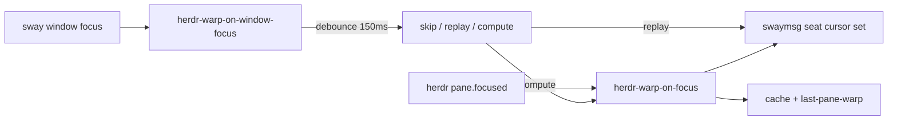

<!-- 47cd453c-e988-4b67-b7da-3a8b2dc9d853 -->
---
todos:
  - id: "watcher"
    content: "Add ~/.local/bin/herdr-warp-on-window-focus (subscribe + kitty filter + debounce + cache replay)"
    status: completed
  - id: "sway-conf"
    content: "Add sway config.d/20-herdr-mouse-warp.conf with exec_always"
    status: completed
  - id: "chezmoi"
    content: "chezmoi add both paths, reload sway, commit+push personal dotfiles"
    status: completed
isProject: false
---
# Sway focus-in → Herdr pane mouse warp

## Why

`herdr-pane-mouse-warp`는 Herdr `pane.focused`만 구독한다. 다른 창으로 나갔다 다시 Kitty/Herdr로 올 때는 내부 pane이 안 바뀌어 이벤트가 안 뜬다. Sway `window` focus로 같은 warp를 트리거한다.

Kitty `on_focus_change` watcher는 이미 떠 있는 창에 reload로 안 붙는다. Sway subscribe는 `exec_always`만으로 현재 세션에 바로 붙는다.

## Approach

- Trigger: `swaymsg -t subscribe -m '["window"]'`, `change == "focus"`
- Filter: `app_id == "kitty"`. Herdr가 아니면 cache/`/proc` child/`title` 검사 후 skip. 다른 Kitty에 현재 Herdr layout을 투영하지 않음
- Debounce: 150ms. 알림 default action은 `swaymsg focus` 다음 `herdr agent focus`라서, 창 복귀 warp가 옛 pane layout을 찍지 않게 함
- Skip: `last-pane-warp`가 200ms 안이면 창 복귀 warp를 생략 (`pane.focused`가 이미 target으로 옮김)
- Cache: pane warp가 `$XDG_RUNTIME_DIR/herdr-warp/pane-<kitty-pid>`에 `x y` / `ww wh`를 씀. 창 크기 같으면 `cursor set`만
- Stale lock: window-focus compute는 `window-pending` token을 들고 가고, 새 focus나 pane warp가 token을 바꿔서 늦은 `cursor set`을 버림
- Single-instance: `$XDG_RUNTIME_DIR` lockfile (waybar watcher와 동일)
- Disable: `HERDR_WARP_ON_FOCUS=0`

## Files

1. Watcher [`~/.config/herdr/plugins/local/herdr-pane-mouse-warp/herdr-warp-on-window-focus`](~/.config/herdr/plugins/local/herdr-pane-mouse-warp/herdr-warp-on-window-focus) (python3), symlink `~/.local/bin/herdr-warp-on-window-focus`
2. Cache/token in [`herdr-warp-on-focus`](~/.config/herdr/plugins/local/herdr-pane-mouse-warp/herdr-warp-on-focus)
3. Sway start [`~/.config/sway/config.d/20-herdr-mouse-warp.conf`](~/.config/sway/config.d/20-herdr-mouse-warp.conf)

## Out of scope

- Kitty watcher `on_focus_change` (기존 창에 reload로 안 붙음; Sway 경로와 이중 fire)
- warp 좌표/placement 변경
- macOS / non-Sway
