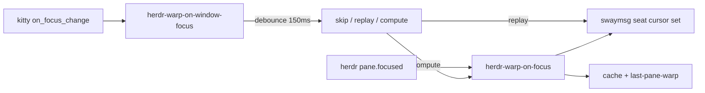

<!-- 47cd453c-e988-4b67-b7da-3a8b2dc9d853 -->
---
todos:
  - id: "watcher"
    content: "Kitty on_focus_change calls one-shot herdr-warp-on-window-focus (debounce + cache replay)"
    status: completed
  - id: "sway-conf"
    content: "Remove sway config.d/20-herdr-mouse-warp.conf long-lived subscriber"
    status: completed
  - id: "chezmoi"
    content: "chezmoi add, kill old watcher, commit+push personal dotfiles"
    status: completed
isProject: false
---
# Kitty focus-in → Herdr pane mouse warp

## Why

`herdr-pane-mouse-warp`는 Herdr `pane.focused`만 구독한다. 다른 창으로 나갔다 다시 Kitty/Herdr로 올 때는 내부 pane이 안 바뀌어 이벤트가 안 뜬다.

Sway subscribe 상주 프로세스 대신, 이미 로드된 Kitty `on_focus_change` watcher가 one-shot helper를 호출한다. 이미 열린 창은 Kitty를 한 번 다시 띄워야 watcher가 붙는다.

## Approach

- Trigger: Kitty `ai-focus-clear-watcher.py` `on_focus_change`. `focused=true`면 `--pid/--title`, `false`면 `--cancel`
- Filter: Herdr가 아니면 cache/`/proc` child/`title` 검사 후 skip
- Debounce: 150ms sleep in the one-shot. 알림 클릭은 `herdr agent focus`가 먼저 target으로 warp
- Skip: `last-pane-warp`가 200ms 안이면 창 복귀 warp 생략
- Cache / stale token: 기존과 동일. `--cancel`과 새 focus-in이 `window-pending`을 바꿔 늦은 warp를 버림
- No long-lived process. Disable: `HERDR_WARP_ON_FOCUS=0`

## Files

1. One-shot [`herdr-warp-on-window-focus`](~/.config/herdr/plugins/local/herdr-pane-mouse-warp/herdr-warp-on-window-focus), symlink `~/.local/bin/herdr-warp-on-window-focus`
2. Kitty watcher [`~/.config/kitty/ai-focus-clear-watcher.py`](~/.config/kitty/ai-focus-clear-watcher.py)
3. Cache/token in [`herdr-warp-on-focus`](~/.config/herdr/plugins/local/herdr-pane-mouse-warp/herdr-warp-on-focus)

## Out of scope

- warp 좌표/placement 변경
- macOS / non-Sway
