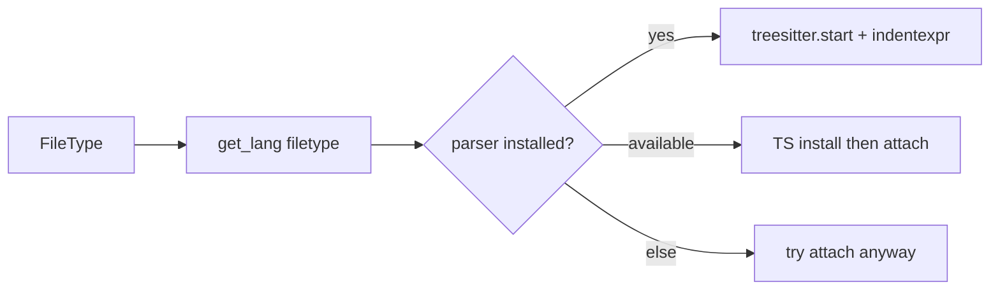

<!-- a1480da6-31ab-476c-be15-349c16e1f653 -->
---
todos:
  - id: "rewrite-treesitter-spec"
    content: "treesitter.lua를 main API로 재작성 (install + FileType attach, 기존 언어 목록 유지)"
    status: pending
  - id: "keep-context"
    content: "nvim-treesitter-context 스펙/opts 유지"
    status: pending
  - id: "verify-health"
    content: "checkhealth 및 주요 filetype에서 highlight/indent 동작 확인 안내"
    status: pending
isProject: false
---
# nvim-treesitter main 설정 마이그레이션

## 문제

[`lazy-lock.json`](lazy-lock.json)은 이미 `nvim-treesitter` **main**을 가리키지만, [`lua/kickstart/plugins/treesitter.lua`](lua/kickstart/plugins/treesitter.lua)는 옛 master API를 그대로 씁니다.

- `ensure_installed` / `auto_install` / `highlight.enable` / `indent.enable` → **main에서 무시됨**
- `main = 'nvim-treesitter.config'` → `setup`은 `install_dir`만 받음
- highlight/indent는 Neovim/`indentexpr`을 **직접** 켜야 함

그래서 플러그인은 떠 있어도, 의도한 “언어 설치 + 하이라이트/인덴트”가 설정으로는 보장되지 않습니다.

## 접근

업스트림 kickstart(0.12/`main`) 패턴을 lazy.nvim 스펙에 맞게 이식합니다. 언어 목록과 treesitter-context 옵션은 유지합니다.



## 변경 파일

[`lua/kickstart/plugins/treesitter.lua`](lua/kickstart/plugins/treesitter.lua)만 수정합니다.

### 1. `nvim-treesitter` 스펙

- `lazy = false` (공식: lazy-loading 미지원)
- `build = ':TSUpdate'` 유지
- `main`/`opts` 제거
- `config`에서:

```lua
local parsers = {
  'bash', 'c', 'diff', 'html', 'lua', 'luadoc',
  'markdown', 'markdown_inline', 'query', 'vim', 'vimdoc',
  'cpp', 'cmake', 'json', 'yaml', 'python', 'latex',
}
require('nvim-treesitter').install(parsers)
```

### 2. FileType autocmd로 highlight + indent

kickstart와 동일한 attach 헬퍼:

- `vim.treesitter.language.add(language)` 성공 시 `vim.treesitter.start(buf, language)`
- indents 쿼리가 있으면 `indentexpr` 설정
- folds는 이전에도 안 켰으므로 주석으로만 남김

`auto_install = true` 대체:

- 이미 설치됨 → 즉시 attach
- `get_available()`에 있음 → `install(language):await(...)` 후 attach
- 그 외(번들 파서 등) → attach 시도

parser 이름 ≠ filetype 문제(`latex` vs `tex`)는 `vim.treesitter.language.get_lang(filetype)`로 처리합니다.

### 3. `nvim-treesitter-context`

기존 `opts` 그대로 둡니다. highlight가 다시 정상 attach되면 context도 함께 동작합니다.

## 확신 수준 (100% 아님)

### 높은 확신 (코드로 확인함)

- 현재 `opts`의 `ensure_installed` / `auto_install` / `highlight` / `indent`는 **main에서 dead config**다. 설치된 `config.lua`는 `install_dir`만 처리한다.
- `install()` + `:await` + `latex` 파서 이름은 이 머신에 깔린 commit(`4916d659`)에 실제로 있다.
- 방향성(파서 설치는 플러그인, highlight는 `vim.treesitter.start`)은 공식 README/현재 kickstart와 같다.

### 중간 확신 / 런타임에서만 확정 가능

- **지금 highlight가 아예 안 되는지**는 세션에서 확인하지 않았다. 예전에 깔린 파서 + Neovim 기본 동작으로 일부는 이미 될 수 있다. “설정이 의도대로 동작한다”는 쪽이 깨진 것이지, “완전 먹통”이라고까지는 단정하지 않는다.
- kickstart의 FileType auto-install은 `ensure_installed` 목록 밖 언어도 열면 설치한다. 옛 `auto_install = true`와 비슷하지만, “목록만 고정”보다 범위가 넓다.
- `lazy = false`는 공식 권고라 채택하지만, 현재 lazy 로딩 상태와의 체감 차이는 실행 후 확인이 필요하다.

### 낮은 리스크이지만 남는 점

- treesitter-context는 API를 거의 안 타서 유지해도 되지만, attach가 안 되면 context도 빈약해 보인다.
- 첫 실행 시 미설치 파서가 있으면 `tree-sitter-cli` 빌드가 돌아가 시작이 잠깐 느려질 수 있다 (cli는 이미 0.26.11 설치됨).

## 검증

1. Neovim 재시작 후 `:checkhealth nvim-treesitter` (cli/parser OK)
2. `lua`/`python`/`tex` 버퍼에서 `:InspectTree` 또는 하이라이트 확인
3. 필요 시 `:TSUpdate` 한 번

이 nvim 설정은 자체 git repo라서, 구현 후 커밋은 요청하실 때만 합니다.
