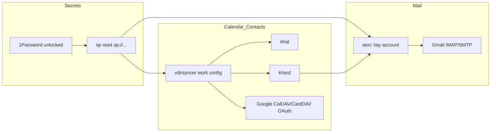

<!-- accd337f-work-gmail-khal -->
---
todos:
  - id: op-secrets
    content: "1Password에 Vay OAuth client + (가능 시) Gmail app password 항목/참조 경로 확정"
    status: pending
  - id: vdirsyncer-work
    content: "개인 config 미수정: ~/.config/work/vdirsyncer/config + vay 로컬/토큰 경로, discover/sync"
    status: pending
  - id: khal-khard
    content: "khal/khard에 회사 collection만 추가 (개인 항목 유지)"
    status: pending
  - id: aerc-vay
    content: "aerc [Vay] 계정 추가; app password면 mbsync+Maildir, 아니면 oauthbearer"
    status: pending
  - id: timer-docs-chezmoi
    content: "work vdirsyncer 유닛/문서 정리 후 work·해당 chezmoi add/commit/push"
    status: pending
isProject: false
---
# 회사 Gmail / Calendar / Contacts → aerc · khal

회사 계정(`sungsik.nam@vay.io`)만 aerc/khal/khard에 연동한다. 비밀값은 1Password CLI(`op read`)로 가져오고, 캘린더·연락처·메일은 OAuth 중심으로 구성하며 개인 계정 설정은 수정하지 않는다.

## 1Password로 암호를 “인증 없이” 가져올 수 있나?

**완전 무인증은 아니다.** 이 머신에서는:

- `op` 2.35 + 1Password 데스크톱이 이미 있고, CLI↔앱 잠금 공유(`cliSharedLockState`)·시스템 인증 unlock이 켜져 있다.
- 1Password가 **잠금 해제된 GUI 세션**이면 `op read op://…`는 비밀번호를 다시 치지 않고 값을 준다(가끔 생체/polkit 한 번).
- **잠겨 있거나**, **systemd timer만** 돌리는 headless 상황에서는 막힐 수 있다. 완전 비대화형은 `OP_SERVICE_ACCOUNT_TOKEN`(서비스 계정)이 필요하다.

메일/캘린더 쪽은 지금 `pass`를 쓰고 있고, 이 노트북에는 GPG 비밀키가 없어 `pass` 복호화가 실패한다. 회사 연동은 **`pass`를 건드리지 않고 `op read`로 전환**하는 편이 맞다.

## 인증 방식 (채택)

| 대상 | 방식 | 이유 |
|------|------|------|
| Calendar / Contacts | vdirsyncer `google_calendar` / `google_contacts` **OAuth** | 개인 쪽 live 설정과 동일·권장. 앱 비밀번호 CalDAV는 문서에만 남은 구식 경로 |
| Gmail IMAP/SMTP | **App Password를 1Password에 두고** mbsync/`aerc` `PassCmd`로 사용 | Workspace에서 허용되면 mbsync→notmuch→aerc 기존 메일 스택과 잘 맞음. XOAUTH2+mbsync는 Ubuntu SASL 플러그인 이슈가 큼 |
| OAuth client id/secret | 1Password `op read` | vdirsyncer용. Google Cloud Desktop OAuth 클라이언트(CalDAV·CardDAV API). 기존 개인용 클라이언트를 재사용하거나 work용으로 새로 만들어 vault에 저장 |

앱 비밀번호가 Workspace 정책으로 막혀 있으면, 메일만 **aerc `imaps+oauthbearer` / `smtps+oauthbearer`** 로 전환하는 fallback을 둔다(로컬 Maildir/notmuch 없이 IMAP 직접).

개인 계정(`pass`의 `mail/gmail/*`, `mail/icloud/*`, 기존 `~/.config/vdirsyncer/config`, `[JmyL]` aerc)은 **읽기만 하고 수정하지 않는다.**

## 구성 분리 (개인 미수정)

- **vdirsyncer (회사 전용 설정 파일)**
  `~/.config/work/vdirsyncer/config`
  - 로컬 경로: `~/.local/share/vdirsyncer/vay/{calendars,contacts}/`
  - 토큰: `~/.local/state/vdirsyncer/vay-google-{calendar,contacts}-token`
  - `client_id`/`client_secret`: `op read op://…`
  - 실행: `VDIRSYNCER_CONFIG=~/.config/work/vdirsyncer/config vdirsyncer …`
  - work chezmoi로 관리

- **khal / khard**
  개인 collection 항목은 그대로 두고, **회사 collection path만 추가**.
  discover 후 실제 디렉터리명(`sungsik.nam@vay.io` 등)에 맞춰 path 설정.

- **aerc**
  `accounts.conf`에 `[Vay]`만 추가. `[JmyL]` 변경 없음.
  `address-book-cmd`의 khard는 회사 addressbook이 보이면 그대로 사용(이미 khard 연동됨).

- **메일 로컬 저장** (앱 비밀번호 경로)
  `~/Mail/Vay/` + work용 mbsync 채널(개인 `icloud` 채널과 분리).
  notmuch는 path/계정을 회사 메일용으로 추가하거나, aerc에서 notmuch 쿼리맵을 Vay용으로 분리.

- **systemd**
  기존 개인용 `vdirsyncer.service`는 건드리지 않음.
  work용 유닛: `VDIRSYNCER_CONFIG=…` + (가능하면) 세션에서 `op` 사용. timer는 1Password unlock 전제; 불안정하면 수동/`herdr`/로그인 후 sync로 시작.

## 참고 문서 (기존)

- `~/.config/calendar-contacts-vdirsyncer.md` — 개인·app-password 예시(구식). 회사 작업의 정본 아님.
- `~/.config/README.md` — 개인 Google OAuth + `pass` 요약.
- `~/.config/aerc/notmuch-migration.md` — iCloud mbsync 초안. Gmail/회사 없음.

회사 절차는 `~/.config/README.md`에 짧은 “Vay Google” 절을 추가하거나 `~/.config/work/` 아래 짧은 노트에 적고, OAuth + `op read`를 기준으로 한다.

## 실행 순서

1. 1Password에 항목 확인/생성: OAuth client id·secret, (가능하면) Gmail app password; `op://Vault/Item/field` 경로 확정.
2. Google Cloud: CalDAV·CardDAV API + Desktop OAuth 클라이언트(필요 시). 브라우저에서 **회사 계정**으로 vdirsyncer 인가.
3. work vdirsyncer config 작성 → `discover` → `sync` → khal/khard path 반영.
4. 메일: app password면 mbsync+aerc `[Vay]`; 아니면 aerc oauthbearer.
5. 수동 sync 검증 후 work timer 검토.
6. work chezmoi로 work 경로 add; aerc/khal/khard 변경은 해당 chezmoi로 add 후 commit/push.

## 사용자 쪽 한 번 필요한 일

- 1Password unlock 유지(또는 서비스 계정 토큰 별도 결정).
- Google 계정 보안에서 **앱 비밀번호 생성 가능 여부** 확인(안 되면 메일 OAuth fallback).
- 첫 `vdirsyncer discover` 시 브라우저 OAuth(회사 계정 로그인).
- (권장) [캘린더 sync 선택 페이지](https://calendar.google.com/calendar/syncselect)에서 동기화할 회사 캘린더 선택.
