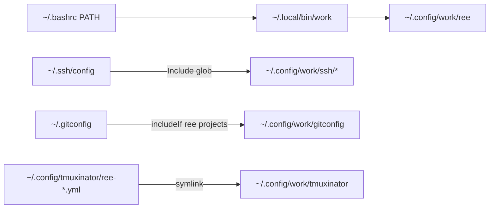

<!-- 48459e5e-4e82-490c-8e34-1c8faf000feb -->
---
todos:
  - id: "work-chezmoi-init"
    content: "chezmoi-work source/config + sungsik-nam-vay/dotfiles-work private repo 생성"
    status: pending
  - id: "move-work-tree"
    content: "~/.config/work/{ree,rddev-devenv,ssh,gitconfig,tmuxinator} + ~/.local/bin/work 로 이동·스크립트 경로 수정"
    status: pending
  - id: "personal-includes"
    content: "개인 ~/.ssh/config Include, ~/.gitconfig includeIf, bashrc PATH; tmuxinator 심볼릭 링크"
    status: pending
  - id: "personal-chezmoi-cleanup"
    content: "개인 chezmoi에서 ree tmuxinator 제거, ignore 갱신, add/commit/push (JmyL)"
    status: pending
  - id: "work-chezmoi-add-push"
    content: "work 파일 chezmoi add / commit / push (sungsik-nam-vay)"
    status: pending
  - id: "verify"
    content: "PATH, ree source, ssh, git email, tmuxinator, chezmoi diff 검증"
    status: pending
isProject: false
---
# Work dotfiles를 `work` 경로 + 별도 chezmoi로 분리

## 왜 예전에 `~/.config/rddev-devenv`를 말했나

스크립트 기본값이 그 경로라 **기본값을 안 바꾸고 ignore만** 하려는 보수안이었다. 목표가 “회사 config는 `~/.config/work/` 아래”이면 **`~/.config/work/rddev-devenv`로 옮기고 스크립트 기본값을 고치는 편**이 맞다. 이번 플랜은 그쪽으로 간다.

## 목표 레이아웃

```text
# 회사 (work chezmoi → sungsik-nam-vay private repo)
~/.config/work/ree/              # 기존 ~/.config/ree
~/.config/work/rddev-devenv/     # 기존 ~/.config/rddev-devenv (Dockerfile)
~/.config/work/gitconfig         # user.email=sungsik.nam@vay.io
~/.config/work/ssh/config        # 기존 ~/.ssh/config의 회사 Host/Canonical*
~/.config/work/tmuxinator/*.yml  # ree-* 프로젝트
~/.local/bin/work/               # ree-*, rddev-*, clangd-rddev

# 개인 (JmyL/dotfiles) — include / PATH만
~/.ssh/config                    # Include ~/.config/work/ssh/*
~/.gitconfig                     # 개인 email + includeIf → work/gitconfig
~/.bashrc                        # [[ -d ~/.local/bin/work ]] && PATH=...
~/.config/tmuxinator/ree-*.yml   # → ../work/tmuxinator/... 심볼릭 링크 (work chezmoi가 생성)
```

건드리지 않음: `~/.config/rddev/` (세션 런타임 데이터).



## Work chezmoi

- Source: `~/.local/share/chezmoi-work`
- Config: [`~/.config/chezmoi/chezmoi-work.toml`](~/.config/chezmoi/chezmoi-work.toml) — `sourceDir`만 지정
- Private repo: `gh repo create sungsik-nam-vay/dotfiles-work --private` (현재 `gh` active account가 `sungsik-nam-vay`)
- 적용: `chezmoi apply` 후 `chezmoi --config ~/.config/chezmoi/chezmoi-work.toml apply`
- 개인 [`AGENTS.md`](~/.config/AGENTS.md) / 워크플로에 work source 한 줄 추가 (편집은 live → `chezmoi -c ... add` → commit/push; push는 `sungsik-nam-vay`)

## 파일별 변경

### 1. `~/.config/ree` → `~/.config/work/ree`

- 디렉터리 이동
- 스크립트 경로 수정:
  - [`~/.local/bin/ree-ssh`](~/.local/bin/ree-ssh), [`ree-bootstrap`](~/.local/bin/ree-bootstrap):  
    `.../ree/lib.sh` → `.../work/ree/lib.sh`, `REE_CONFIG`도 동일

### 2. Binaries → `~/.local/bin/work/`

이동: `ree-*`, `rddev-bootstrap`, `rddev-devenv`, `clangd-rddev`  
[`rddev-bootstrap`](~/.local/bin/rddev-bootstrap)의 `clangd-rddev` 하드코딩 경로를 `~/.local/bin/work/clangd-rddev` 또는 `command -v`로 수정.

[`~/.bashrc`](~/.bashrc)에:

```bash
[[ -d "$HOME/.local/bin/work" ]] && PATH="$HOME/.local/bin/work:$PATH"
```

(개인 chezmoi로 추적)

### 3. `rddev-devenv` → `~/.config/work/rddev-devenv`

- Dockerfile 이동
- [`rddev-devenv`](~/.local/bin/rddev-devenv) 기본 `CONFIG_DIR`를  
  `${XDG_CONFIG_HOME:-$HOME/.config}/work/rddev-devenv` 로 변경

### 4. SSH include

- 회사 블록 전부 → [`~/.config/work/ssh/config`](~/.config/work/ssh/config)
- 개인 [`~/.ssh/config`](~/.ssh/config) (신규 chezmoi 관리):

```sshconfig
Include ~/.config/work/ssh/*

Host *
  ConnectTimeout 10
  TCPKeepAlive yes
```

와일드카드 Include라 work 파일이 없는 머신에서는 무시됨.

### 5. Git include

- 개인 [`~/.gitconfig`](~/.gitconfig) (신규 chezmoi 관리):  
  `user.name`, `user.email=jmyl@me.com` (aerc와 동일), credential helpers 유지
- includeIf (ree 프로젝트만 회사 메일):

```gitconfig
[includeIf "gitdir:~/projects/ree-/"]
    path = ~/.config/work/gitconfig
[includeIf "gitdir:~/projects/ree-**/"]
    path = ~/.config/work/gitconfig
```

- work 파일: `user.email=sungsik.nam@vay.io`

### 6. Tmuxinator

- `ree-*.yml`을 개인 chezmoi source에서 삭제 후 `~/.config/work/tmuxinator/`로 이동
- work chezmoi가 `~/.config/tmuxinator/ree-*.yml` → `../work/tmuxinator/...` 심볼릭 링크 생성 (tmuxinator 기본 검색 경로 유지)

## 개인 chezmoi 정리 ([`~/.local/share/chezmoi`](~/.local/share/chezmoi))

- [`.chezmoiignore`](~/.local/share/chezmoi/.chezmoiignore): 기존 `ree-*` / `.config/ree/` 대신

```ignore
.local/bin/work/
.config/work/
```

- `dot_config/tmuxinator/ree-*.yml` 제거
- `dot_bashrc` PATH 패치, `dot_ssh/config`, `dot_gitconfig` 추가 후 `chezmoi add` → commit → `JmyL`으로 push

## 검증

- `ree-ssh` / `ree-bootstrap`가 `work/ree/lib.sh`를 source
- `echo $PATH`에 `~/.local/bin/work`
- `ssh -G ts-dummy` 등으로 work Host 옵션 반영 확인
- `git -C ~/projects/ree-drive config user.email` → `vay.io`; 개인 repo는 `jmyl@me.com`
- `tmuxinator start ree-drive` (또는 list)에 work 프로젝트 보임
- `chezmoi diff` / work `chezmoi -c ... diff` 깨끗함
