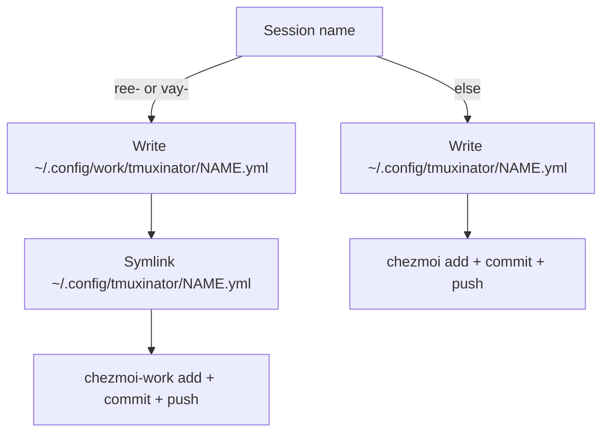

<!-- 1b4566b9-b248-493e-8a81-0f72e994f91e -->
---
todos:
  - id: "helper"
    content: "Add tmuxinator-chezmoi helper: prefix routing, paths, chezmoi add/remove, .chezmoiremove, commit+push with correct gh user"
    status: pending
  - id: "create-save"
    content: "Wire tmuxinator-new-session, new-popup, and save-session to work YAML+symlink or personal path + track"
    status: pending
  - id: "delete-rename"
    content: "Update project-action delete/copy/rename for symlink+work target and .chezmoiremove sync"
    status: pending
  - id: "track-push"
    content: "chezmoi add scripts, update short docs, commit+push personal (and work README if touched)"
    status: pending
isProject: false
---
# Work-prefix tmuxinator create/save/delete

## Behavior

Prefix rule: name matches `ree-*` or `vay-*` → **work**; otherwise → **personal**.

**Create** ([tmuxinator-new-session](/home/sungsik/.local/bin/tmuxinator-new-session), [tmuxinator-new-popup](/home/sungsik/.local/bin/tmuxinator-new-popup)):
- Work: create stub YAML under `~/.config/work/tmuxinator/`, symlink into `~/.config/tmuxinator/`, open editor on the real file (do not call plain `tmuxinator new`, which always writes into the XDG dir).
- Personal: keep current `tmuxinator new` flow.
- After the YAML exists: `chezmoi add` (work config for work paths), then commit + push the matching repo.

**Save** ([tmuxinator-save-session](/home/sungsik/.local/bin/tmuxinator-save-session)):
- Same prefix routing: work writes target YAML then ensures symlink; personal writes directly under `~/.config/tmuxinator/`.
- Then chezmoi add + commit + push.

**Delete** ([tmuxinator-project-action](/home/sungsik/.local/bin/tmuxinator-project-action) `delete`):
- If symlink → remove link **and** work target.
- Remove from the owning chezmoi source (`forget` / delete source entries for YAML and `symlink_NAME.yml`).
- Append to that repo’s [`.chezmoiremove`](https://www.chezmoi.io/reference/special-files/chezmoiremove/):
  - Work delete: `.config/tmuxinator/NAME.yml` and `.config/work/tmuxinator/NAME.yml`
  - Personal delete: `.config/tmuxinator/NAME.yml`
- Commit + push. Missing paths in `.chezmoiremove` are fine — apply only removes existing matches, no error.

**Copy/rename** (same script, while touching it): apply the same prefix rule so `ree-`/`vay-` copies land in work+symlink, and renames that cross personal↔work move files correctly, then chezmoi add/remove + `.chezmoiremove` + commit/push.

## Shared helper

Add something like [`~/.local/bin/tmuxinator-chezmoi`](/home/sungsik/.local/bin/tmuxinator-chezmoi) (personal-managed) used by the wrappers:

- `is_work_name`, `paths_for`, `ensure_work_link`
- `track_add` / `track_delete` (chezmoi add or source cleanup + `.chezmoiremove` append, dedupe lines)
- `commit_push` for the right source dir:
  - Personal: `~/.local/share/chezmoi`, `gh auth switch --user JmyL` then push
  - Work: `~/.local/share/chezmoi-work` with `--config ~/.config/chezmoi/chezmoi-work.toml`, `gh auth switch --user sungsik-nam-vay` then push
- Commit subjects in imperative style (e.g. `Track tmuxinator session NAME`, `Remove tmuxinator session NAME`)

Work symlink source format already used: [`symlink_ree-drive.yml`](/home/sungsik/.local/share/chezmoi-work/dot_config/tmuxinator/symlink_ree-drive.yml) contents `../work/tmuxinator/ree-drive.yml`.

## Chezmoi / docs

- Ensure work repo has `.chezmoiremove` (create on first delete if absent); personal similarly.
- Scripts stay under personal chezmoi (`~/.local/bin/tmuxinator-*`); after edits: `chezmoi add` those scripts, commit + push personal repo.
- Briefly note the prefix + delete/`.chezmoiremove` behavior in [chezmoi-work README](/home/sungsik/.local/share/chezmoi-work/README.md) and/or [AGENTS.md](/home/sungsik/.config/AGENTS.md) chezmoi section.

## Out of scope

- Raw `tmuxinator new/delete` without the wrappers (M-o / save path remain the supported UI).
- One-shot cleanup of old personal-laptop `ree-*` orphans (can still use a temporary personal `.chezmoiremove` later if needed).
