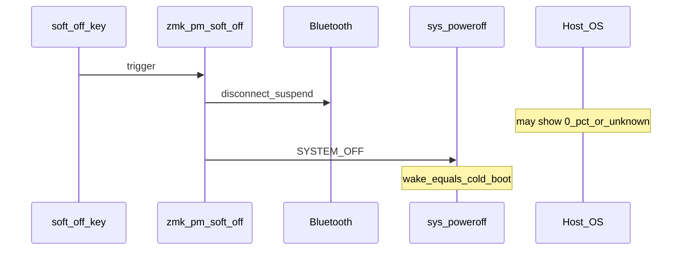

<!-- 96357d85-8789-4da1-86b5-179e1479a078 -->
---
todos:
  - id: "confirm-where"
    content: "0% 관측 위치(호스트/OLED)·스플릿·soft_off 설정 방식 확인"
    status: pending
  - id: "narrow-cause"
    content: "끊김 표시 vs ADC/핀 충돌 vs 초기값 중 하나로 원인 확정"
    status: pending
  - id: "fix-or-explain"
    content: "필요 시 DT/keymap 수정안 제시, 아니면 동작 설명으로 마무리"
    status: pending
isProject: false
---
# soft_off 이후 배터리 0% — 원인 정리

## 결론 (현재 정보 기준)

**soft_off가 배터리 측정 회로를 영구적으로 망가뜨린다는 잘 알려진 단일 버그는 없습니다.** soft_off는 deep sleep과 같이 `sys_poweroff()`(nRF SYSTEM OFF)로 들어가고, wake는 사실상 cold boot입니다. RAM 잔류 때문에 %가 “0에 고정”되는 구조는 아닙니다.

대신 soft_off **직후**에 0%로 보이기 쉬운 이유는 아래가 흔합니다.

## 가장 유력한 원인들

### 1. 연결 끊김을 0%로 표시 (스플릿/호스트)

soft_off는 BLE를 끊습니다.

- 스플릿 central은 peripheral이 끊기면 해당 쪽 배터리를 **0%로 보고하는 것이 의도된 동작**으로 논의됨 ([PR #2938](https://github.com/zmkfirmware/zmk/pull/2938) 코멘트: “peripheral disconnect → 0% as expected”).
- OS 배터리 아이콘도 disconnect 시 0%/알 수 없음으로 바뀌었다가, 재연결 후에도 BAS를 바로 안 고치는 경우가 있음.

→ OLED/위젯은 정상인데 **호스트만 0%**면 이쪽.

### 2. 펌웨어 내부 초기값이 0

[`battery.c`](https://github.com/zmkfirmware/zmk/blob/main/app/src/battery.c)에서 `last_state_of_charge`는 **0으로 시작**합니다. 첫 성공 측정 전/측정 실패가 반복되면 표시·이벤트가 0에 머무를 수 있습니다. (참고: [#2972](https://github.com/zmkfirmware/zmk/issues/2972)는 실제 0%일 때 GATT가 100%로 남는 **반대 증상**.)

→ **디스플레이도 계속 0%**면 측정 실패 또는 전압이 실제로 ≤ ~3.45V로 읽히는 쪽.

### 3. soft_off 설정과 핀 충돌 (하드웨어 통합 시)

keymap에 `&soft_off`만 넣은 경우는 드물고, `soft_off_wakers` / `extra-gpios` / sideband wakeup을 넣으면 **배터리 ADC 핀과 GPIO가 겹칠** 수 있습니다. 그때 ADC가 ~0V → LiPo 맵에서 0% (`≤ 3450 mV`).

→ soft_off **활성화 커밋과 동시에** 배터리만 깨졌다면 이쪽을 의심.

### 4. soft_off와 무관한 착시

soft_off 직후 재연결이 불안정한 사례도 있음 ([#2791](https://github.com/zmkfirmware/zmk/issues/2791)). 배터리가 “이상해진” 것처럼 보이지만 본질은 연결/프로파일 문제일 수 있음.

## soft_off가 하는 일 (배터리와 직접 관계)

## 확인 순서 (로컬 설정 없이 가능한 체크)

1. **0%가 보이는 곳**: OS / OLED·nice!view / 둘 다
2. **스플릿인지**, soft_off한 쪽이 central인지 peripheral인지
3. soft_off 없이 **리셋만** 했을 때 %가 정상인지
4. soft_off 직후 **재연결까지 기다린 뒤**에도 0인지
5. 배터리 케이블을 뽑았다 끼워 **완전 전원 사이클** 후 정상인지

| 관측 | 해석 |
|------|------|
| 호스트만 0%, OLED 정상 | BAS/호스트 캐시 또는 끊김 표시 |
| 스플릿 한쪽만 0%, 그 쪽 미연결 | central의 disconnect→0% 동작 |
| OLED도 계속 0%, 리셋 후에도 동일 | ADC/핀 충돌 또는 센서 fetch 실패 |
| 전원 완전 차단 후에만 회복 | 드묾 — 핀 latch/설정 잔류 의심, DT 재검토 |

## 다음에 필요한 정보

아래가 오면 원인을 하나로 좁혀 수정안까지 잡을 수 있습니다.

- 키보드/컨트롤러 (예: Corne + nice!nano)
- 0%를 **어디서** 보는지
- 스플릿 여부
- soft_off를 keymap `&soft_off`만 켰는지, wakeup/`extra-gpios`까지 넣었는지
- (가능하면) 해당 `*.conf` / keymap / overlay 링크

지금은 **코드 변경 플랜이 아니라 원인 진단** 단계입니다. 위 정보가 오면 그에 맞춰 설정 수정 또는 “호스트/스플릿 표시 이슈라 펌웨어 수정 불필요”로 확정하면 됩니다.
