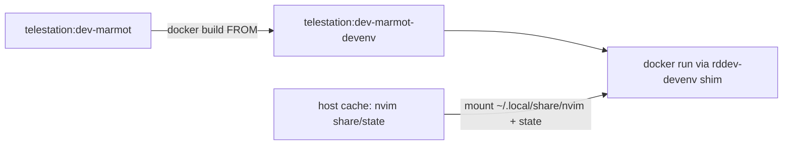

<!-- 054ed25e-626c-428a-ad91-def9f515685d -->
---
todos:
  - id: "dockerfile"
    content: "~/.config/rddev-devenv/Dockerfile (FROM base + apt + tree-sitter) 추가"
    status: pending
  - id: "shim-image"
    content: "rddev-devenv: overlay ensure/build + docker run 이미지 치환"
    status: pending
  - id: "persist-mounts"
    content: "nvim share/state + ~/.cargo 를 rddev-devenv cache에 persist 마운트"
    status: pending
  - id: "slim-bootstrap"
    content: "bootstrap에서 매회 apt/cargo install 제거, verify v 유지"
    status: pending
  - id: "verify"
    content: "reattach 후 툴·Mason이 recreate에도 남는지 검증"
    status: pending
isProject: false
---
# rddev-devenv: overlay 이미지로 영속화

## Dev Containers로 쉽게 되나?

**이 레포에는 `.devcontainer`가 없고**, 사실상 [`misc/rddev`](misc/rddev)가 그 역할입니다 (이미지 pull/build, GPU/udev/CAN/SSH/AWS 마운트, worktree 등).

Cursor/VS Code Dev Containers의 핵심 아이디어는 맞습니다: `FROM <base>` Dockerfile로 툴을 이미지에 굽기. 다만 Dev Containers UI/스펙으로 **rddev를 대체**하면 마운트·권한·하드웨어 포워딩을 다시 만들어야 해서 이득이 없습니다.

→ **Dev Container “개념”만 빌려서**, 개인 wrapper [`~/.local/bin/rddev-devenv`](~/.local/bin/rddev-devenv) 안에서 overlay 이미지를 쓰는 쪽이 맞습니다. (가벼운 nvim 프로필 제안은 폐기.)

## 왜 bootstrap apt만으로는 부족한지

rddev는 `docker run`마다 **새 컨테이너**를 뜹니다 (`DEV_IMAGE_URI` = `telestation:dev-marmot` 등). 컨테이너 writable layer의 apt/`cargo install`은 recreate 시 사라집니다. reboot≈재생성.

두 층이 다릅니다:

| 종류 | 예 | recreate 생존 방법 |
|------|----|-------------------|
| 시스템 툴 | nodejs, npm, ripgrep, tree-sitter-cli | **base 위 overlay 이미지** |
| 홈에 설치 | Mason LSP, lazy plugins (`~/.local/share/nvim`) | **호스트 cache bind-mount** (이미지에 넣기 어려움) |

둘 다 해야 “리붓했다고 다시 설치”가 거의 없습니다. base 이미지 digest가 바뀌면 overlay만 다시 빌드.

## 설계 (채택)



### 1. Personal Dockerfile + image tag

위치 예: `~/.config/rddev-devenv/Dockerfile` (chezmoi 밖, repo 밖)

```dockerfile
ARG BASE_IMAGE=telestation:dev-marmot
FROM ${BASE_IMAGE}
USER root
RUN apt-get update && DEBIAN_FRONTEND=noninteractive apt-get install -y --no-install-recommends \
      luarocks ripgrep fd-find python3-venv nodejs npm \
    && rm -rf /var/lib/apt/lists/*
# tree-sitter into image cargo home (root-owned, fine for CLI on PATH)
ENV CARGO_HOME=/usr/local/cargo RUSTUP_HOME=/usr/local/rustup
RUN /usr/local/cargo/bin/cargo install tree-sitter-cli
# Mason이 user로 cargo install 할 때 쓸 writable default (컨테이너 홈; 아래 mount와 별개)
ENV CARGO_HOME=/home/ree/.cargo
USER ree
```

태그: `telestation:dev-marmot-devenv` (platform은 `DEVENV_COMPUTE_PLATFORM`에 맞춤).

### 2. `rddev-devenv`가 이미지 교체

[`misc/rddev`](misc/rddev)는 `DEV_IMAGE_URI` override가 없음 → **repo 수정 없이** docker shim에서 `run` 인자 중 `telestation:dev-<platform>`을 `telestation:dev-<platform>-devenv`로 치환.

`bootstrap` / `ensure_overlay_image`:
- base id: `docker inspect -f '{{.Id}}' telestation:dev-marmot`
- 기록된 base id와 다르거나 overlay 없으면 `docker build --build-arg BASE_IMAGE=... -t ...-devenv`
- base가 그대로면 **no-op** (재시작마다 apt 안 돌림)

### 3. nvim Mason/lazy persist (추천 범위)

shim에 추가 마운트 (rddev cache 옆 personal cache):

- `${XDG_CACHE_HOME}/rddev-devenv/nvim-share` → `/home/ree/.local/share/nvim`
- `${XDG_CACHE_HOME}/rddev-devenv/nvim-state` → `/home/ree/.local/state/nvim`

첫 nvim에서 Mason 한 번 설치 후, recreate해도 유지.

`CARGO_HOME=/home/ree/.cargo`는 이미 env로 있음 → 같은 방식으로  
`${XDG_CACHE_HOME}/rddev-devenv/cargo` → `/home/ree/.cargo` 마운트하면 alejandra 등 user `cargo install`도 유지 (호스트 `~/.cargo` 마운트 아님 → glibc 문제 없음).

### 4. bootstrap 역할 축소

- **제거/축소:** 매 실행 `apt-get install`, sudo `cargo install tree-sitter` (이미지에 포함)
- **유지:** overlay ensure(build if needed), nvim/`v`/Documents 마운트, `verify v`
- **제거:** 가벼운 프로필 / `NVIM_MINIMAL` 관련 (미구현·계획만 있던 것 정리)

### 5. 검증

1. `rddev-devenv bootstrap` → overlay build 1회, `docker image ls`에 `*-devenv`
2. attach 후 `node`/`npm`/`rg`/`tree-sitter`/`v` 즉시 사용
3. nvim에서 Mason 설치 → `restart`/`reattach` 후에도 mason bin 유지
4. base 이미지 id를 바꾸면(또는 스탬프 삭제) overlay rebuild만 발생

## 범위 밖

- repo `misc/rddev`에 Dev Containers / 공식 overlay 지원 추가 (원하면 후속)
- 호스트 `~/.cargo` bind-mount (glibc 불일치)
