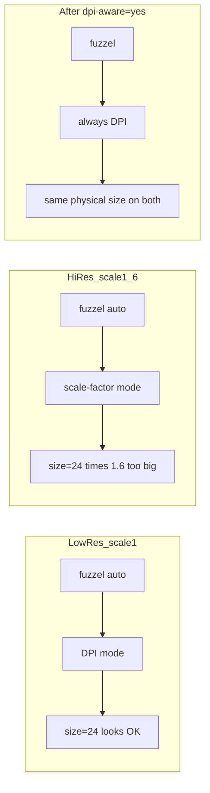

<!-- 9e00d1b0-d366-4f81-ba43-42383190adbe -->
# fuzzel 폰트가 스케일된 모니터에서만 커 보이는 이유

## 왜 kitty는 괜찮은데 fuzzel만?

둘 다 “폰트 크기”를 쓰지만, **스케일을 반영하는 방식이 다릅니다.**

| | kitty | fuzzel (기본값) |
|---|---|---|
| 설정 | `font_size 11.0` (pt) | `font=...:size=24` |
| 동작 | 항상 pt + DPI로 물리 크기 맞춤 | `dpi-aware=auto` (기본) |
| scale 1.6일 때 | 스케일은 선명도에 쓰고, 글자 물리 크기는 유지 | **스케일 팩터로 폰트를 키움** → 커 보임 |

fuzzel man page 요약:

- `dpi-aware=yes` → 모니터 **DPI**로 크기 결정. 스케일을 올려도 폰트가 두 배로 안 커짐. 물리 크기가 모니터마다 비슷해짐.
- `dpi-aware=no` → **스케일 팩터**로 크기 결정. scale 1.6이면 폰트도 ~1.6배.
- `dpi-aware=auto` (기본) → 모든 출력이 scale 1이면 DPI, **하나라도 scale > 1이면 스케일 팩터 모드**.

지금 상황과 정확히 맞습니다.

- 저해상도(scale 1): `auto` → DPI 모드 → `size=24`가 괜찮았음.
- 고해상도(kanshi scale 1.6): `auto` → 스케일 모드 → 같은 `size=24`가 스케일에 곱해져 너무 큼.

kitty는 처음부터 DPI/pt 모델이라 kanshi 스케일과 “이중으로” 안 커집니다.

관련 설정:

- [`~/.config/fuzzel/fuzzel.ini`](~/.config/fuzzel/fuzzel.ini): `font=Noto Sans Mono:size=24` (`dpi-aware` 미설정 = auto)
- [`~/.config/kanshi/config`](~/.config/kanshi/config): 고해상도에서 `scale 1.6` / `kanshi-autoscale`의 1.5
- [`~/.config/kitty/kitty.conf`](~/.config/kitty/kitty.conf): `font_size 11.0`

## 할 일

1. [`~/.config/fuzzel/fuzzel.ini`](~/.config/fuzzel/fuzzel.ini)의 `[main]`에 `dpi-aware=yes` 추가.
2. `size=24`는 일단 유지 (저해상도에서 DPI로 봤을 때 괜찮았던 값이므로, yes로 고정하면 고해상도에서도 그 물리 크기에 맞춰짐).
3. fuzzel 한 번 띄워 두 모니터(또는 두 kanshi 프로필)에서 확인. EDID DPI가 잘못된 모니터면 미세 조정만 (`size=22` 등).
4. `chezmoi add ~/.config/fuzzel/fuzzel.ini` → diff → commit/push (dotfiles 워크플로).

## 하지 않을 것

- kanshi scale을 폰트 때문에 내리지 않음 (터미널/UI 전체 스케일 문제와 분리).
- 모니터마다 다른 fuzzel 설정을 스크립트로 갈아끼우지 않음 (`dpi-aware=yes`면 불필요).
