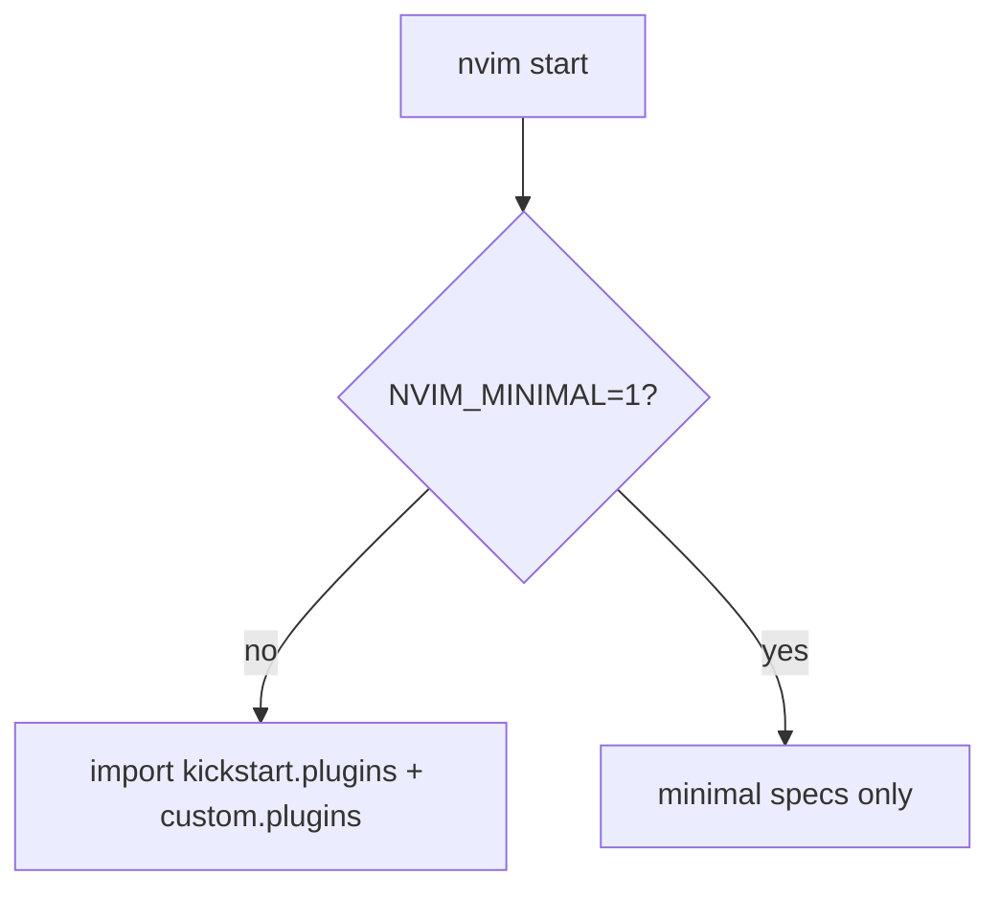

<!-- 054ed25e-626c-428a-ad91-def9f515685d -->
---
todos:
  - id: "profile-module"
    content: "nvim에 lua/profile.lua 추가 — NVIM_MINIMAL=1이면 minimal"
    status: pending
  - id: "lazy-branch"
    content: "lazy-plugins.lua에서 minimal일 때 kickstart/custom 전체 import 대신 소량 스펙만 로드"
    status: pending
  - id: "shim-env"
    content: "rddev-devenv docker shim에 -e NVIM_MINIMAL=1 주입"
    status: pending
  - id: "verify-minimal"
    content: "컨테이너에서 nvim 기동 시 Mason 대량 설치/에러 없이 뜨는지 확인"
    status: pending
isProject: false
---
# 컨테이너용 가벼운 nvim 프로필

## 원인 요약 (참고)

에러는 Mason이 `npm` 없는 환경에서 LSP/formatter를 깔고, root-owned `CARGO_HOME`에 `cargo install`을 시도해서 난 것. 컨테이너에서는 그 툴 스택이 사실상 불필요 → **의존성 추가보다 설정을 줄이는 쪽**이 맞음.

## 제안 (채택)

같은 `~/.config/nvim` 마운트를 유지하고, **rddev-devenv가 `NVIM_MINIMAL=1`을 넣으면** lazy가 무거운 플러그인/Mason을 로드하지 않음.

호스트(env 없음) = 지금과 동일한 full 구성.



### 1. [`~/.config/nvim/lua/profile.lua`](/home/sungsik/.config/nvim/lua/profile.lua) (신규)

```lua
return {
  minimal = vim.env.NVIM_MINIMAL == '1',
}
```

트리거는 **shim 명시 env만** (자동 `/.dockerenv` 감지 안 함). 나중에 컨테이너에서 full nvim이 필요하면 `NVIM_MINIMAL=` 끄고 재실행하면 됨.

### 2. [`~/.config/nvim/lua/lazy-plugins.lua`](/home/sungsik/.config/nvim/lua/lazy-plugins.lua)

`require 'profile'` 후:

- **full** (기본): 지금처럼 `{ import = 'kickstart.plugins' }`, `{ import = 'custom.plugins' }`
- **minimal**: import 대신 편집 스펙만 나열. 권장 세트:
  - 유지: `guess-indent`, `which-key`, `todo-comments`, `theme`, `treesitter`(파서 설치는 nvim 쪽, mason 아님), `telescope`, `gitsigns`, `oil` (파일 탐색)
  - 제외: `lspconfig`(mason-tool-installer 포함), `blink`, `format`/`lint`(외부 툴), `debug`, 및 custom의 AI/obsidian/image/remote 등

treesitter는 이미지에 이미 `tree-sitter` CLI가 있으니 파서 빌드는 가능. Mason/`npm` 경로는 타지 않음.

### 3. [`~/.local/bin/rddev-devenv`](/home/sungsik/.local/bin/rddev-devenv) shim

기존 `APPIMAGE_EXTRACT_AND_RUN=1` 옆에:

```bash
-e NVIM_MINIMAL=1 \
```

`reattach`만으로는 env가 안 바뀌므로, **한 번 `rddev-devenv restart`(또는 bootstrap)** 후 attach 필요.

### 4. 하지 않는 것

- bootstrap에 `nodejs`/`npm` / writable `CARGO_HOME` 추가 **안 함** (minimal이면 불필요).
- nvim config를 컨테이너용으로 따로 복사/마운트 **안 함**.

## 검증

1. shim에 env 반영 후 컨테이너 restart.
2. `echo $NVIM_MINIMAL` → `1`, `nvim` 기동 시 Mason 대량 설치 UI/에러 없음.
3. 호스트에서 `NVIM_MINIMAL` 없이 nvim → 기존 full 구성 유지.
