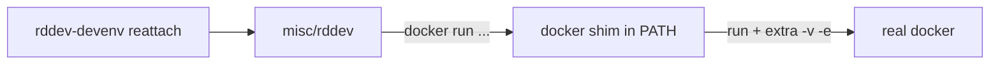

<!-- 02528c0c-58ed-4953-a40f-7ebd005506da -->

---

todos:

- id: "rddev-devenv-script"
  content: "~/.local/bin/rddev-devenv 작성: rddev 위임, Container name 파싱, docker shim, bootstrap"
  status: pending
- id: "docker-shim"
  content: "docker run 시 ~/.config/nvim + ~/.local/bin/nvim volume 주입"
  status: pending
  isProject: false

---

# rddev-devenv (Neovim AppImage + config mount)

## Approach

Option 3: **`~/.local/bin/rddev-devenv`가 `misc/rddev`를 위임 호출**하고, `PATH` 앞단 `docker` shim으로 volume만 주입. rddev의 mount 목록은 재구현하지 않음.

**이 작업은 chezmoi로 관리하지 않는다.** `~/.local/bin/rddev-devenv`(및 shim 생성물)만 두면 되고, chezmoi add/commit/push 대상이 아님.

### docker shim이 하는 일

`rddev`는 내부에서 `/usr/bin/docker run ...`을 호출한다. shim은 그 앞에 놓는 가짜 `docker` 실행 파일이다.

1. `rddev-devenv start`가 `PATH="$shim_dir:$PATH"`로 `misc/rddev start`를 실행
2. rddev가 `docker run ...`을 호출 → 실제로는 shim이 받음
3. shim이 인자 앞에 **아래 몇 개만** 덧붙인 뒤, 진짜 `/usr/bin/docker`로 넘김

rddev가 원래 넣던 마운트(레포, `.config` 캐시, SSH, X11 등)는 그대로 두고, 우리가 필요한 것만 추가:

```bash
# shim이 docker run 에 끼워 넣는 것 (개념)
docker run \
  -v "$HOME/.config/nvim:/home/ree/.config/nvim" \
  -v "$HOME/.local/bin/nvim:/usr/local/bin/nvim:ro" \
  -e APPIMAGE_EXTRACT_AND_RUN=1 \
  ...rddev가 넘긴 나머지 인자 그대로...
```

`docker ps` / `docker exec` / `docker rm` 등은 손대지 않고 그대로 통과.



## Prerequisites (one-time, manual — not the script)

호스트에서 Neovim AppImage를 받아 확장자 제거 후 실행 권한:

```bash
# 예: 공식 AppImage를 ~/.local/bin/nvim 으로
chmod +x ~/.local/bin/nvim
```

`rddev-devenv`는 이 파일을 마운트만 한다.

## Mounts (shim이 `docker run`에 주입)

- `$HOME/.config/nvim` → `/home/ree/.config/nvim`
- `$HOME/.local/bin/nvim` → `/usr/local/bin/nvim:ro` (컨테이너 `PATH`에 이미 포함)
- `-e APPIMAGE_EXTRACT_AND_RUN=1` (FUSE 없을 때)

## 컨테이너 이름

rddev `preflight`가 항상 출력하는 줄을 파싱한다:

```text
Container name: rddev-sungsik-projects-ree-drive-ff1aadac
```

```bash
# 예: repo의 misc/rddev status 출력에서
sed -n 's/^.*Container name: //p'
```

`bootstrap`(마운트 여부 검사·필요 시 restart) 등에서 이 이름을 사용한다. `start`/`reattach` 자체는 shim + `misc/rddev` 위임.

## Commands

rddev와 동일한 명령은 **그대로 위임** (`PATH`에 shim 켠 채):

- `start` | `stop` | `restart` | `attach` | `reattach` | `status`

**추가:** `bootstrap`

- 호스트 `~/.local/bin/nvim` 존재·실행 가능 확인
- 파싱한 컨테이너 이름 기준으로, 떠 있는데 devenv volume이 없으면 restart로 마운트 적용

평소에는 **`rddev-devenv reattach`만** 쓰면 된다.

## 사용 flow

### 최초 1회 (호스트)

```bash
# AppImage 받아서 이름/권한만 정리 (스크립트 밖)
chmod +x ~/.local/bin/nvim
# ~/.local/bin/rddev-devenv 설치
```

### 평소 (worktree/repo 안에서)

```bash
cd ~/projects/ree-drive          # 또는 다른 worktree
rddev-devenv reattach
# → shim PATH 설정
# → misc/rddev reattach (떠 있으면 stop+start, 아니면 start 후 attach)
# → start 시점 docker run 에 nvim config/바이너리 -v 주입
# → 컨테이너 셸 진입

nvim                            # /usr/local/bin/nvim = 호스트 AppImage
# ~/.config/nvim 은 호스트와 동일 파일
```

### 컨테이너가 이미 떠 있는데 마운트가 없을 때

```bash
rddev-devenv bootstrap
# → rddev status 에서 Container name 파싱
# → docker inspect 로 nvim volume 없으면 restart
# 이후 attach / 또는 reattach
```

### 호스트 재부팅 후

컨테이너는 `--rm`이라 없음. 다시 `rddev-devenv reattach`하면 start부터 해서 마운트 포함으로 뜸.

## Deliverable

[`~/.local/bin/rddev-devenv`](/home/sungsik/.local/bin/rddev-devenv) 단일 스크립트 (shim은 스크립트가 cache 등에 생성하거나 내장 함수로 처리).

## Out of scope

- 공유 dev 이미지 / ECR / `misc/rddev` 레포 패치
- chezmoi / tool-inventory 변경
