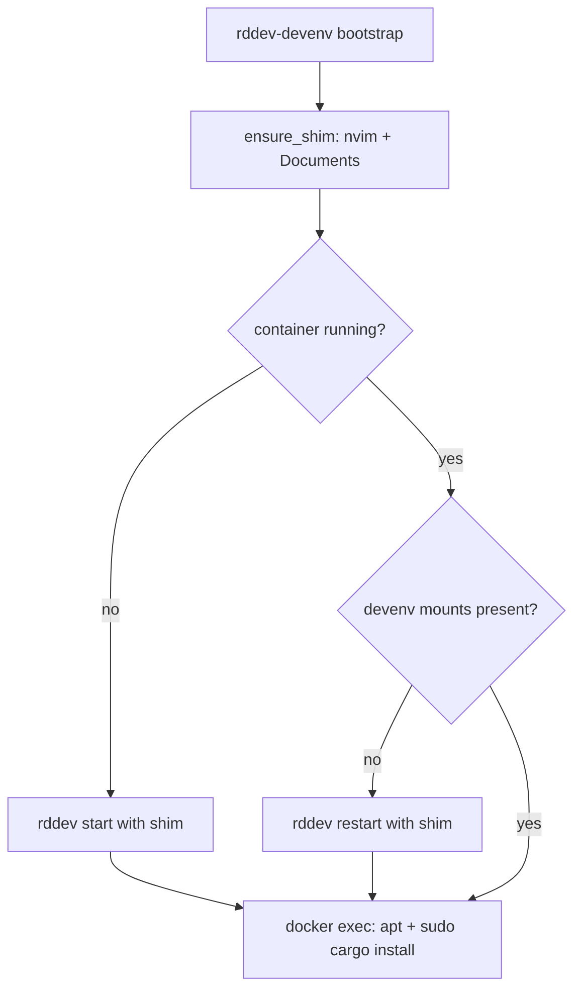

<!-- 054ed25e-626c-428a-ad91-def9f515685d -->

---

todos:

- id: "shim-mounts"
  content: "ensure_shim + has_devenv_mounts에 ~/Documents → /home/ree/Documents 마운트만 추가"
  status: pending
- id: "bootstrap-setup"
  content: "bootstrap에서 apt update/install + sudo cargo install tree-sitter-cli 멱등 실행"
  status: pending
- id: "verify"
  content: "bootstrap 후 Documents 마운트, apt pkgs, /usr/local/cargo/bin/tree-sitter 확인"
  status: pending
  isProject: false

---

# rddev-devenv bootstrap 확장

대상 파일: [`/home/sungsik/.local/bin/rddev-devenv`](/home/sungsik/.local/bin/rddev-devenv) (repo 밖 personal wrapper)

## 깨끗한 컨테이너 조사 (`telestation:dev-marmot`, plain `rddev start`)

컨테이너를 지우고 재생성한 뒤 확인한 **stock** 상태:

| 항목          | Stock 상태                                                                                                                                              |
| ------------- | ------------------------------------------------------------------------------------------------------------------------------------------------------- |
| OS / user     | Ubuntu 24.04.4, `ree` (`HOME=/home/ree`), passwordless sudo                                                                                             |
| Rust          | `cargo`/`rustc` 1.94.1 at `/usr/local/cargo` (root 소유), `CARGO_HOME=/usr/local/cargo`, `RUSTUP_HOME=/usr/local/rustup`, PATH에 `/usr/local/cargo/bin` |
| `~/.cargo`    | 없음. shell rc에 cargo 설정도 없음                                                                                                                      |
| Write         | `ree`는 `/usr/local/cargo`·`/usr/local/bin`에 쓰기 불가 → tool 설치에 sudo 필요                                                                         |
| `sudo cargo`  | sudo는 PATH에서 cargo를 잃고 `CARGO_HOME`도 unset → env를 명시해야 함                                                                                   |
| apt pkgs      | `luarocks` / `ripgrep` / `fd-find` / `python3-venv` **미설치**. `apt-get update` 후에야 candidate 보임                                                  |
| tree-sitter   | 없음                                                                                                                                                    |
| `~/Documents` | 없음 (마운트도 없음)                                                                                                                                    |

## 설계 결정

- **`.cargo` 마운트 없음** / **shell rc에 `CARGO_HOME` 변경 없음**.
- `cargo install` 권한 문제는 이미지의 root-owned `CARGO_HOME=/usr/local/cargo` 때문 → **`sudo` + env 명시**로 그 경로에 설치.

## 구현

### 1. Docker shim: Documents만 추가 (`ensure_shim`)

기존 nvim 마운트와 함께:

- `${HOME}/Documents` → `/home/ree/Documents` (`mkdir -p` if missing)

`has_devenv_mounts`에 `/home/ree/Documents` 검사 추가.

### 2. `bootstrap` 후반: 컨테이너 안 멱등 setup

마운트 확보 후 `docker exec`로:

```bash
sudo DEBIAN_FRONTEND=noninteractive apt-get update -qq
sudo DEBIAN_FRONTEND=noninteractive apt-get install -y --no-install-recommends \
  luarocks ripgrep fd-find python3-venv

# sudo는 cargo PATH / CARGO_HOME을 지우므로 명시
if ! command -v tree-sitter >/dev/null; then
  sudo env \
    PATH="/usr/local/cargo/bin:/usr/local/sbin:/usr/local/bin:/usr/sbin:/usr/bin:/sbin:/bin" \
    CARGO_HOME=/usr/local/cargo \
    RUSTUP_HOME=/usr/local/rustup \
    cargo install tree-sitter-cli
fi
```

설치 위치: `/usr/local/cargo/bin/tree-sitter` (이미 user PATH에 포함). 수 분 소요 가능 → bootstrap 메시지 출력.

### 3. 흐름



`start` / `restart` / `reattach`는 shim으로 Documents 마운트 적용. apt·cargo install은 **`bootstrap`에서만**.

### 4. 범위 밖

- repo `misc/rddev` 변경 없음
- `.cargo` 마운트 / bashrc `CARGO_HOME` 패치 없음
- `fdfind` → `fd` 심링크 생략 (필요 시 후속)

## 검증

1. `rddev-devenv bootstrap` 후 inspect에 `/home/ree/Documents` 마운트.
2. attach 후: `dpkg -l luarocks ripgrep fd-find python3-venv`, `which tree-sitter` → `/usr/local/cargo/bin/tree-sitter`, `ls ~/Documents`.
