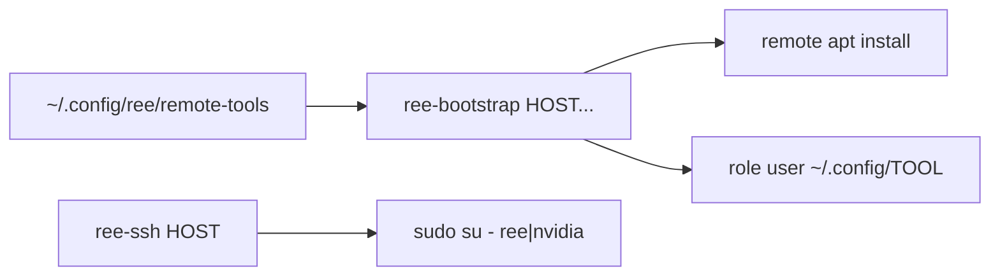

<!-- 9b4a3a13-1ea6-4c60-9f5d-86191347496f -->
---
todos:
  - id: "lib-tools"
    content: "Create ~/.config/ree/lib.sh and ~/.config/ree/remote-tools (lnav, vifm)"
    status: pending
  - id: "ree-ssh"
    content: "Create ~/.local/bin/ree-ssh (passwordless sudo su - to role user)"
    status: pending
  - id: "ree-bootstrap"
    content: "Create ~/.local/bin/ree-bootstrap (apt + silent config sync)"
    status: pending
  - id: "chezmoiignore"
    content: "Add .local/bin/ree-* and .config/ree/ to .chezmoiignore; commit and push"
    status: pending
isProject: false
---
# ree-ssh / ree-bootstrap (chezmoi 비관리)

## 범위

- **포함**: 역할 감지 SSH 래퍼, apt 설치 + `~/.config/<tool>` 복사, remote-tools 목록, chezmoi ignore
- **제외**: tmux 세션/패널 스크립트 전부 (직접 `ree-ssh` 호출)

## 파일 배치 (live only, chezmoi 미추적)

| 경로 | 역할 |
|------|------|
| [`~/.local/bin/ree-ssh`](/home/sungsik/.local/bin/ree-ssh) | 호스트 역할에 맞게 passwordless `sudo su -` 후 interactive shell |
| [`~/.local/bin/ree-bootstrap`](/home/sungsik/.local/bin/ree-bootstrap) | remote-tools 목록으로 apt 설치 + config 동기화 |
| [`~/.config/ree/remote-tools`](/home/sungsik/.config/ree/remote-tools) | 원격에 설치할 도구 이름 (한 줄에 하나; `lnav`, `vifm`으로 시작) |
| [`~/.config/ree/lib.sh`](/home/sungsik/.config/ree/lib.sh) | 역할/타겟 유저 헬퍼 (두 스크립트가 source) |

`remote-tools`는 “타겟에 깔 목록”이라는 뜻이 드러나서 그대로 씀.



## 역할 규칙 (`lib.sh`)

호스트 이름으로 역할 결정 (기존 SSH config 패턴과 맞춤):

- `ts-*`, `mapkit-*-ts*` → 타겟 유저 `ree`
- `ve-*`, `mapkit-*-ve*` → 타겟 유저 `nvidia`
- 그 외 → 에러 종료

## `ree-ssh`

```bash
ree-ssh <host> [ssh args...]
# → ssh -t <host> [args...] "exec sudo su - <ree|nvidia>"
```

- `RequestTTY` 확보를 위해 `-t` 고정
- 서버에서 `sudo su -`는 비밀번호를 묻지 않음 (passwordless)

## `ree-bootstrap`

```bash
ree-bootstrap <host> [host...]
```

호스트마다, [`~/.config/ree/remote-tools`](/home/sungsik/.config/ree/remote-tools)의 각 이름 `TOOL`에 대해:

1. **설치** (로그인 유저, sudo 없음): `ssh "$host" "apt-get install -y -- TOOL"`
2. **config 복사**: 로컬 `~/.config/TOOL`이 있으면 원격 역할 유저 home의 `~/.config/TOOL`로 통째로 동기화  
   - 예: `tar` 파이프 + `sudo su - <user> -c 'tar -x -C ~/.config'`  
   - 로컬에 `~/.config/TOOL`이 없으면 설치만 하고 config는 **조용히** 건너뜀 (경고 없음)

주석(`#`)·빈 줄은 remote-tools 파일에서 무시.

## chezmoi 비관리

[`~/.local/share/chezmoi/.chezmoiignore`](/home/sungsik/.local/share/chezmoi/.chezmoiignore)에 destination 패턴 추가 (source-only 파일이라 여기만 직접 수정):

```
# Work remote helpers — keep unmanaged
.local/bin/ree-*
.config/ree/
```

이후 `chezmoi add` / apply 대상에서 제외. ree 스크립트·remote-tools 목록은 커밋하지 않음. ignore 변경만 chezmoi 저장소에 커밋·푸시.

## 초기 `remote-tools` 내용

```
lnav
vifm
```

## 사용 예

```bash
ree-bootstrap ts-de-ber-00022 ve-us-00230
ree-ssh ts-de-ber-00022
ree-ssh ve-us-00230
```
